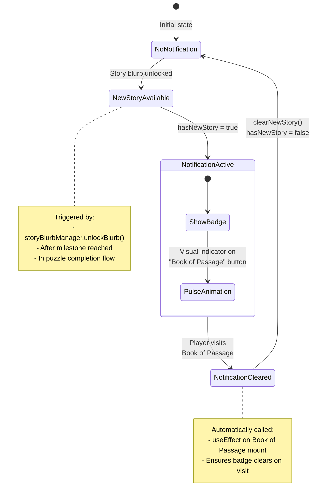

# Book of Passage Screen Architecture Diagram

## Overview
The Book of Passage is the player's personal journal in Chronicles of the Kethaneum. It displays story progression through **narrative blurbs**, tracks **discovered books** with completion progress, and maintains a **story history** log. The screen integrates with multiple systems to provide a comprehensive view of the player's journey.

## Main Architecture

```mermaid
graph TB
    subgraph "UI Component"
        BookPage[app/book-of-passage/page.tsx<br/>Main Screen Component]
        Tabs[Three Tabs:<br/>Current Story | Story History | Discovered Books]
        Filters[Search, Sort, Genre Filter<br/>Pagination]
    end

    subgraph "React Hooks"
        UseStoryProg[useStoryProgress<br/>Story blurb management]
        UseGameState[useGameState<br/>Game state integration]
        UsePageLoader[usePageLoader<br/>Loading state]
        UseStoryNotif[useStoryNotification<br/>New content alerts]
    end

    subgraph "Story Blurb System"
        BlurbMgr[storyBlurbManager<br/>Blurb orchestrator]
        BlurbData[story-progress.json<br/>Blurb definitions]
        TriggerCheck[checkTriggerConditions<br/>Milestone detection]
    end

    subgraph "Book Registry"
        BookReg[bookRegistry<br/>Book metadata manager]
        RegData[bookRegistry.json<br/>Title→ID, genre, parts]
        TitleIdMap[Title to ID mapping<br/>Cache layer]
    end

    subgraph "Game State"
        GS_Story[storyProgress:<br/>currentBlurb, unlockedBlurbs, firedTriggers]
        GS_Books[books: {[title]: boolean[]}<br/>Part completion tracking]
        GS_Discovered[discoveredBooks: Set<string><br/>All found books]
        GS_BookParts[bookPartsMap: {[title]: number[]}<br/>Available parts per book]
    end

    subgraph "Notification System"
        NotifContext[StoryNotificationContext<br/>hasNewStory flag]
        NavIndicator[Book of Passage Button<br/>Visual notification badge]
    end

    subgraph "Data Processing"
        ProcessBooks[processedBooks<br/>Transform to display format]
        CalcProgress[Calculate completion %<br/>completedParts / totalParts]
        GenreExtract[Extract unique genres<br/>From discovered books]
    end

    BookPage --> Tabs
    BookPage --> Filters
    BookPage --> UseStoryProg
    BookPage --> UseGameState
    BookPage --> UsePageLoader
    BookPage --> UseStoryNotif

    UseStoryProg --> BlurbMgr
    BlurbMgr --> BlurbData
    BlurbMgr --> TriggerCheck

    UseGameState --> GS_Story
    UseGameState --> GS_Books
    UseGameState --> GS_Discovered
    UseGameState --> GS_BookParts

    BookPage --> BookReg
    BookReg --> RegData
    BookReg --> TitleIdMap

    UseStoryNotif --> NotifContext
    NotifContext --> NavIndicator

    GS_Books --> ProcessBooks
    GS_Discovered --> ProcessBooks
    GS_BookParts --> ProcessBooks
    ProcessBooks --> CalcProgress
    ProcessBooks --> GenreExtract

    style BookPage fill:#4CAF50,stroke:#2E7D32,color:#fff
    style BlurbMgr fill:#2196F3,stroke:#1565C0,color:#fff
    style BookReg fill:#FF9800,stroke:#E65100,color:#fff
    style ProcessBooks fill:#9C27B0,stroke:#6A1B9A,color:#fff
```

## Three-Tab Structure

```mermaid
graph TB
    subgraph "Book of Passage Tabs"
        Tab1[Current Story Tab]
        Tab2[Story History Tab]
        Tab3[Discovered Books Tab]
    end

    subgraph "Current Story Content"
        CS_Blurb[Current Blurb Display<br/>title + text]
        CS_Stats[Stats Summary<br/>Books: total, completed, in-progress]
        CS_Beat[Story Beat: hook → resolution<br/>Hidden from user]
    end

    subgraph "Story History Content"
        SH_List[Chronological List<br/>All unlocked blurbs]
        SH_Entry[History Entry:<br/>number, title, text]
        SH_Empty[Empty state:<br/>"Journey has just begun"]
    end

    subgraph "Discovered Books Content"
        DB_Search[Search Box<br/>Filter by title]
        DB_Filters[Genre Filter + Sort Options<br/>title | progress | genre]
        DB_List[Book List (paginated)<br/>10 books per page]
        DB_Book[Book Entry:<br/>title, genre, progress bar,<br/>part indicators, Read Story button]
        DB_Pagination[Prev/Next Navigation<br/>Page X of Y]
    end

    Tab1 --> CS_Blurb
    Tab1 --> CS_Stats
    Tab1 --> CS_Beat

    Tab2 --> SH_List
    SH_List --> SH_Entry
    SH_List --> SH_Empty

    Tab3 --> DB_Search
    Tab3 --> DB_Filters
    Tab3 --> DB_List
    DB_List --> DB_Book
    Tab3 --> DB_Pagination

    style Tab1 fill:#e3f2fd
    style Tab2 fill:#f3e5f5
    style Tab3 fill:#fff3e0
```

## Story Blurb Flow


## Discovered Books Processing

```mermaid
graph TB
    Start[discoveredBooks: Set<string>]

    Start --> Loop{For each<br/>book title}

    Loop --> GetBookData[Get books[title]<br/>Array or {complete: true}]
    Loop --> GetPartsMap[Get bookPartsMap[title]<br/>Available parts]

    GetBookData --> CheckFormat{Book data<br/>format?}
    CheckFormat -->|Array| CountArray[Count completed parts<br/>filter(c => c === true).length]
    CheckFormat -->|Object| AllComplete[All parts complete<br/>completedParts = totalParts]

    CountArray --> CalcPercent[progressPercent =<br/>completedParts / totalParts * 100]
    AllComplete --> CalcPercent

    CalcPercent --> GetGenre[Get genre from registry<br/>bookRegistry.getBookIdByTitle()]
    GetGenre --> BuildDisplay[Build BookDisplayData:<br/>id, title, genre, totalParts,<br/>completedParts, progressPercent,<br/>partsStatus, isComplete]

    BuildDisplay --> NextBook[Next book]
    NextBook --> Loop

    Loop -->|Done| ReturnBooks[Return processedBooks[]]

    style BuildDisplay fill:#4CAF50,stroke:#2E7D32,color:#fff
    style CalcPercent fill:#2196F3,stroke:#1565C0,color:#fff
```

## Filtering & Sorting System

```mermaid
graph TB
    subgraph "Input Controls"
        SearchInput[Search Input<br/>Filter by title text]
        GenreSelect[Genre Dropdown<br/>Filter by genre]
        SortSelect[Sort Dropdown<br/>title | progress | genre]
    end

    subgraph "Filter Pipeline"
        Start[processedBooks: BookDisplayData[]]
        GenreFilter{Apply Genre Filter}
        SearchFilter{Apply Search Filter}
        SortBooks{Apply Sort}
        Paginate{Paginate}
        Display[paginatedBooks<br/>Display 10 books]
    end

    subgraph "Sort Algorithms"
        SortTitle[Title: A-Z alphabetical]
        SortProgress[Progress: High to Low %<br/>Then by title for ties]
        SortGenre[Genre: A-Z<br/>Then by title within genre]
    end

    SearchInput --> SearchFilter
    GenreSelect --> GenreFilter
    SortSelect --> SortBooks

    Start --> GenreFilter
    GenreFilter -->|genre !== 'all'| FilterByGenre[Keep only matching genre]
    GenreFilter -->|genre === 'all'| SearchFilter

    FilterByGenre --> SearchFilter
    SearchFilter -->|query.trim()| FilterByQuery[title.includes(query)]
    SearchFilter -->|empty query| SortBooks

    FilterByQuery --> SortBooks
    SortBooks -->|title| SortTitle
    SortBooks -->|progress| SortProgress
    SortBooks -->|genre| SortGenre

    SortTitle --> Paginate
    SortProgress --> Paginate
    SortGenre --> Paginate

    Paginate --> Display

    style FilterByGenre fill:#fff9c4
    style FilterByQuery fill:#fff9c4
    style Paginate fill:#c8e6c9
```

## Story Blurb Data Structure

```mermaid
graph TB
    subgraph "story-progress.json"
        ConfigFile[Configuration]
        Version[version: 1]
        TrigConfig[triggerConfig]
        Blurbs[blurbs: StoryBlurb[]]
    end

    subgraph "TriggerConfig"
        TC_Multi[allowMultiplePerTrigger: false]
        TC_Default[defaultStoryBeat: 'hook']
        TC_Milestones[milestones:<br/>booksDiscovered: [5, 10, 25, 50, 100]<br/>puzzlesComplete: [10, 25, 50, 100]<br/>booksComplete: [5, 10, 25]]
    end

    subgraph "StoryBlurb"
        SB[StoryBlurb]
        SB_ID[id: string<br/>'hook_002']
        SB_Beat[storyBeat: StoryBeat<br/>'hook' | 'first_plot_point' | ...]
        SB_Trigger[trigger: StoryTrigger<br/>'first_book_complete']
        SB_Title[title: string<br/>'A Story Restored']
        SB_Text[text: string<br/>Narrative content]
        SB_Order[order: number<br/>Display sequence]
        SB_Meta[metadata: {tags: string[]}]
    end

    subgraph "StoryProgressState (GameState)"
        SPS[StoryProgressState]
        SPS_Current[currentBlurbId: string]
        SPS_Unlocked[unlockedBlurbs: string[]<br/>Chronological order]
        SPS_Beat[currentStoryBeat: StoryBeat]
        SPS_Updated[lastUpdated: number<br/>Timestamp]
        SPS_Fired[firedTriggers: StoryTrigger[]<br/>Prevent re-triggering]
    end

    ConfigFile --> Version
    ConfigFile --> TrigConfig
    ConfigFile --> Blurbs

    TrigConfig --> TC_Multi
    TrigConfig --> TC_Default
    TrigConfig --> TC_Milestones

    Blurbs --> SB
    SB --> SB_ID
    SB --> SB_Beat
    SB --> SB_Trigger
    SB --> SB_Title
    SB --> SB_Text
    SB --> SB_Order
    SB --> SB_Meta

    SPS --> SPS_Current
    SPS --> SPS_Unlocked
    SPS --> SPS_Beat
    SPS --> SPS_Updated
    SPS --> SPS_Fired

    style ConfigFile fill:#fff3e0
    style SB fill:#e3f2fd
    style SPS fill:#ffebee
```

## Book Registry Integration


## Notification System Flow



## Page Loading State Machine


## Book Entry Display Components

```mermaid
graph TB
    subgraph "Single Book Entry"
        Entry[Book Entry Container]
        Header[Book Header]
        TitleRow[Title + Genre Badge]
        ProgressText[Completed Parts Text<br/>"3/5 parts (60%)"]
        ProgressBar[Visual Progress Bar<br/>Filled to completion %]
        PartsList[Part Indicators Grid<br/>Numbered circles, filled if complete]
        Actions[Actions Row]
        ReadButton[Read Story Button<br/>Only if completedParts > 0]
    end

    Entry --> Header
    Header --> TitleRow
    Header --> ProgressText

    Entry --> ProgressBar
    Entry --> PartsList
    Entry --> Actions
    Actions --> ReadButton

    subgraph "Part Indicator States"
        PartPending[⭕ Pending<br/>Gray circle]
        PartComplete[🔵 Complete<br/>Filled blue circle]
    end

    PartsList --> PartPending
    PartsList --> PartComplete

    style Entry fill:#fff3e0
    style ProgressBar fill:#c8e6c9
    style ReadButton fill:#e3f2fd
```

## Access Control & Routing

```mermaid
graph TB
    Start[Navigate to /book-of-passage]

    Start --> CheckMode{gameMode === 'story'?}

    CheckMode -->|No| Redirect[router.push('/puzzle')<br/>Redirect to puzzle screen]
    CheckMode -->|Yes| CheckReady{Dependencies ready?}

    CheckReady -->|No| ShowLoader[Display PageLoader<br/>"Loading your Book of Passage..."]
    CheckReady -->|Yes| DisplayPage[Display Book of Passage]

    ShowLoader --> CheckReady

    DisplayPage --> CheckInitialized{Story initialized?}
    CheckInitialized -->|No| InitFirstBlurb[initializeWithFirstBlurb<br/>Unlock "game_start" blurb]
    CheckInitialized -->|Yes| ShowContent[Show current content]

    InitFirstBlurb --> ShowContent

    style Redirect fill:#ffcdd2
    style ShowLoader fill:#fff9c4
    style DisplayPage fill:#c8e6c9
```

## Data Flow: Puzzle Complete → Book of Passage Update

```mermaid
sequenceDiagram
    participant Player
    participant Puzzle
    participant GameLogic
    participant GameState
    participant BlurbMgr
    participant SaveSys
    participant BookPage

    Player->>Puzzle: Complete final word
    Puzzle->>GameLogic: checkWinCondition()
    GameLogic->>GameLogic: endGame(win = true)

    GameLogic->>GameState: Update state:<br/>• completedPuzzles++<br/>• books[title][part] = true<br/>• discoveredBooks.add(title)

    GameLogic->>BlurbMgr: checkTriggerConditions(state, prevState)
    activate BlurbMgr

    BlurbMgr->>BlurbMgr: Detect milestone<br/>(e.g., first_book_complete)
    BlurbMgr->>BlurbMgr: unlockBlurb(blurbId)
    BlurbMgr-->>GameState: Updated storyProgress

    deactivate BlurbMgr

    GameState->>SaveSys: Save updated state
    SaveSys->>SaveSys: Persist to localStorage

    Note over GameState,BookPage: Player navigates to Book of Passage

    Player->>BookPage: Visit page
    BookPage->>GameState: Load current state
    GameState-->>BookPage: discoveredBooks, books, storyProgress

    BookPage->>BookPage: processedBooks:<br/>• Calculate progress %<br/>• Build display data

    BookPage->>BookPage: Render:<br/>• New blurb in Current Story<br/>• Updated book in Discovered Books
```



## Integration Points


## Key Features & Behaviors

```mermaid
graph LR
    subgraph "Features"
        F1[Three-Tab Interface<br/>Current | History | Discovered]
        F2[Auto-Initialize<br/>First blurb on game start]
        F3[Story Mode Only<br/>Redirect other modes]
        F4[Real-Time Notifications<br/>Badge on nav button]
        F5[Search & Filter<br/>By title and genre]
        F6[Pagination<br/>10 books per page]
        F7[Progress Visualization<br/>% bars + part indicators]
        F8[Coming Soon: Read Story<br/>Modal for completed books]
    end

    subgraph "Behaviors"
        B1[Clear Notification<br/>On page visit]
        B2[Reset Filters<br/>On search/genre/sort change]
        B3[Preserve State<br/>Between visits]
        B4[Graceful Degradation<br/>Continue without registry]
        B5[Loading States<br/>Minimum 500ms display]
        B6[Access Control<br/>Story mode only]
    end

    style F1 fill:#e3f2fd
    style F4 fill:#fff9c4
    style F7 fill:#c8e6c9
    style B1 fill:#ffebee
    style B3 fill:#f3e5f5
```

## Performance Characteristics

- **Page Load**: ~200-800ms (depends on data size)
- **Story Blurb Load**: ~50-200ms (JSON fetch + parse)
- **Registry Load**: ~50-150ms (JSON fetch + cache build)
- **Book Processing**: ~5-20ms (depends on # discovered books)
- **Filter/Sort**: ~1-10ms (client-side array operations)
- **Pagination**: <1ms (array slice)
- **Notification Update**: <1ms (context state change)

## Testing Considerations

Key areas to test when modifying the Book of Passage:

1. **Story Blurb Display**
   - Current blurb shows correctly
   - Blurb unlocks on trigger
   - Notification appears/clears properly
   - First blurb initializes on game start

2. **Story History**
   - Chronological order preserved
   - All unlocked blurbs appear
   - Empty state displays correctly
   - Tab only visible when history exists

3. **Discovered Books**
   - All discovered books listed
   - Progress % calculated correctly
   - Part indicators match completion
   - Completed books marked properly

4. **Filtering & Sorting**
   - Search filters by title (case-insensitive)
   - Genre filter works correctly
   - Sort options produce correct order
   - Pagination resets on filter change

5. **Book Registry Integration**
   - Genre information displays
   - Title→ID mapping works
   - Fallback when registry unavailable
   - Cache prevents duplicate loads

6. **Access Control**
   - Story mode only (redirects others)
   - Navigation buttons appear correctly
   - "Return to Books" visible when appropriate

7. **State Persistence**
   - Story progress persists across visits
   - Book progress saves correctly
   - Unlocked blurbs maintain order
   - Fired triggers prevent re-unlocking

## Future Considerations

1. **Read Story Modal**: Full story reader for completed books
2. **Export Story**: Download story history as text/PDF
3. **Share Progress**: Social sharing of milestones
4. **Achievement Integration**: Track story-based achievements
5. **Branching Narratives**: Player choices affect story blurbs
6. **Animated Blurbs**: Visual effects on blurb unlock
7. **Audio Narration**: Voice-acted story blurbs
8. **Book Covers**: Visual representations of discovered books
9. **Timeline View**: Visual timeline of story progression
10. **Search Enhancement**: Full-text search across blurb content
