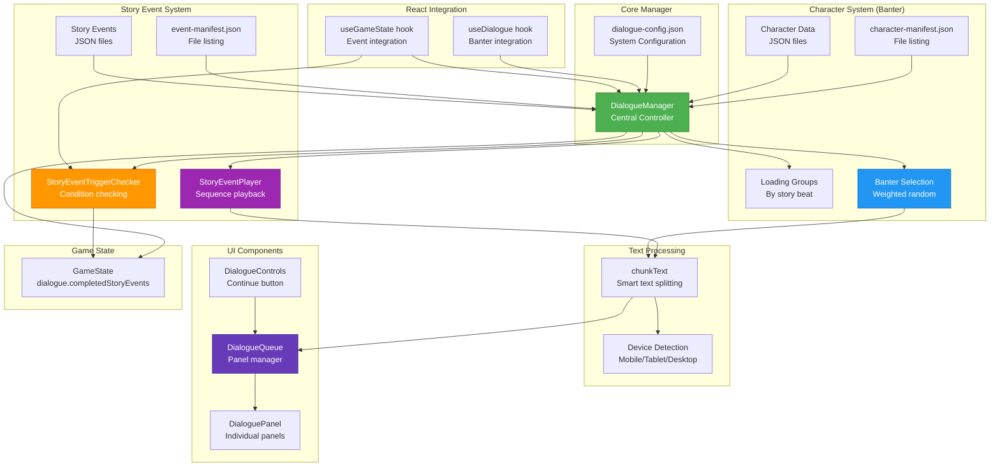
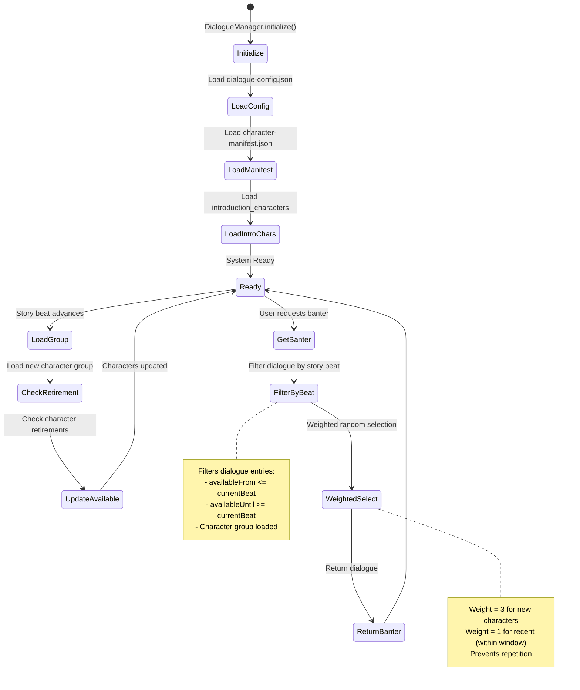
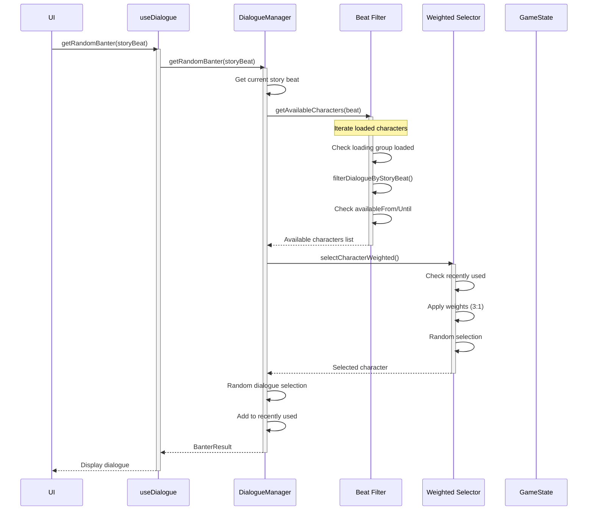
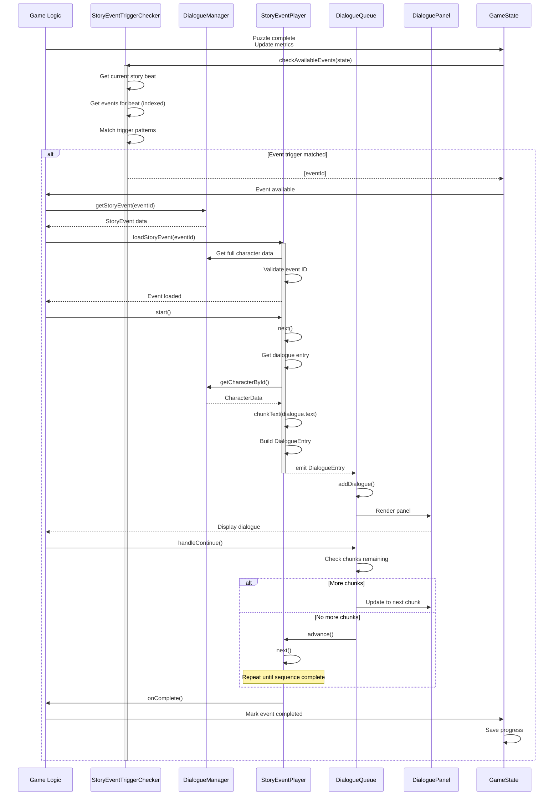
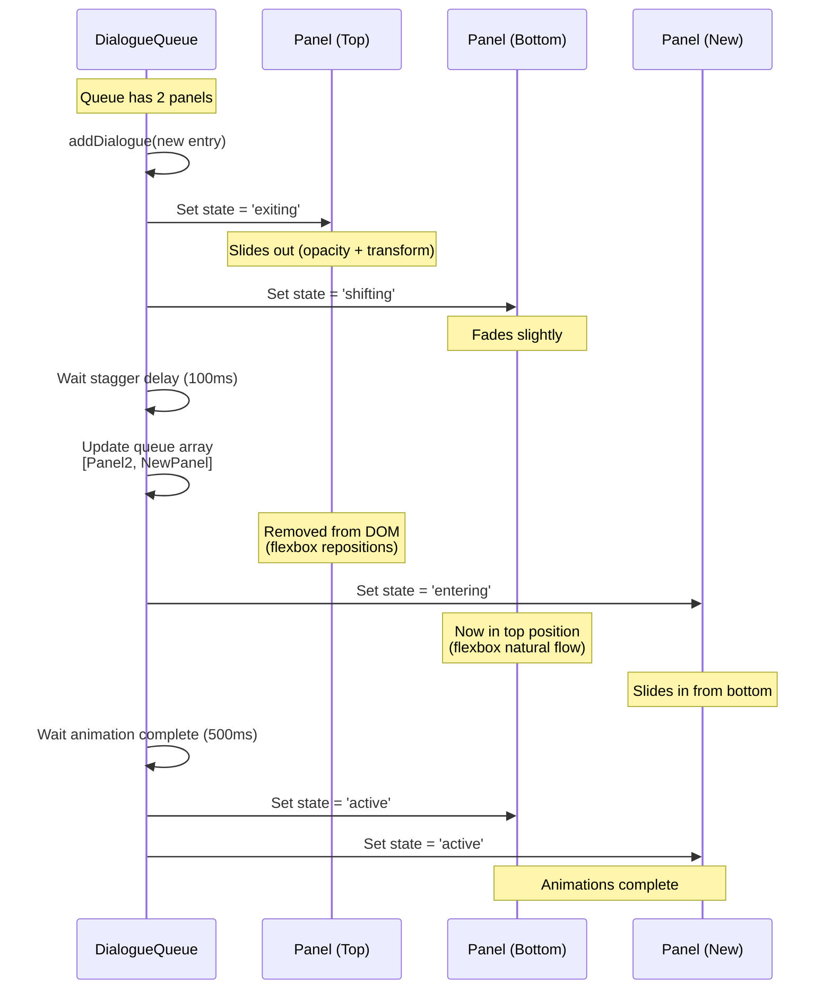
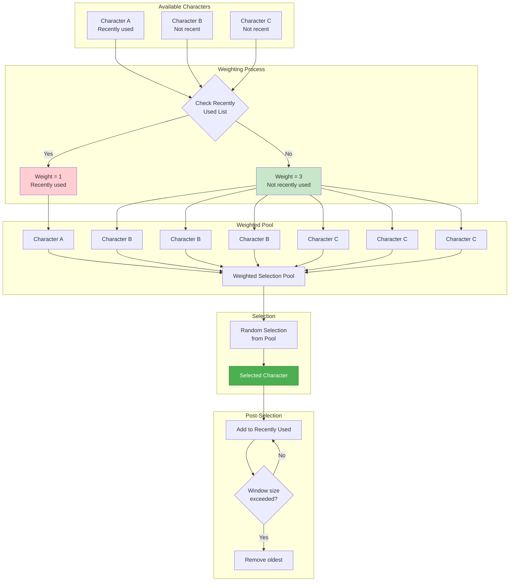
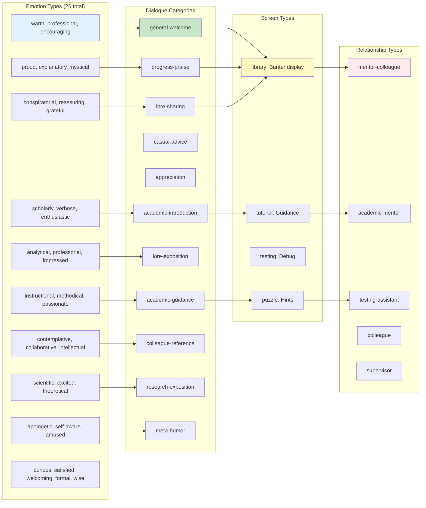
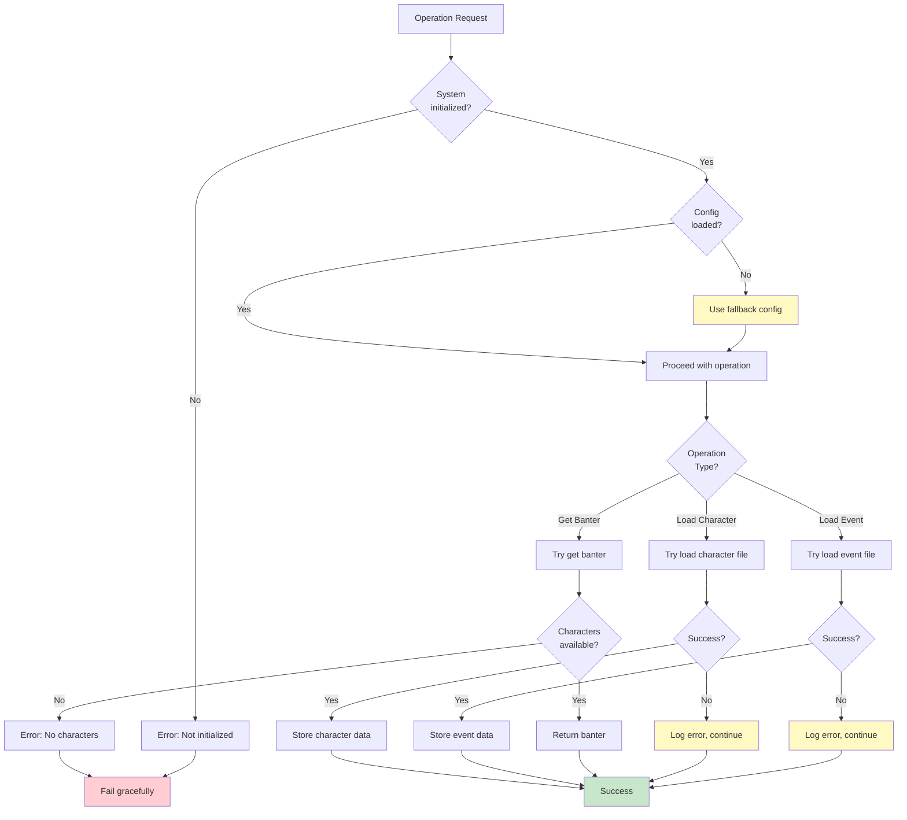

# Dialogue System Architecture Diagram

## Overview
The Chronicles of the Kethaneum dialogue system manages two distinct types of dialogue: **Banter** (random character interactions) and **Story Events** (scripted multi-character sequences). The system provides character loading, smart text chunking, and adaptive UI rendering.

## Main Architecture



## Character Loading & Management



## Banter System Flow



## Story Event System Flow



## Character Data Structure

```mermaid
graph TB
    subgraph "Character JSON File"
        CharFile[character.json]
        CharDef[character:<br/>id, name, title, description]
        Portrait[portraitFile]
        Group[loadingGroup]
        Retire[retireAfter]
        Specialties[specialties: string[]]
        BanterArr[banterDialogue: array]
        Metadata[metadata]
    end

    subgraph "Banter Dialogue Entry"
        BanterEntry[BanterDialogue]
        B_ID[id: unique string]
        B_Text[text: dialogue content]
        B_Emotion[emotion: Emotion[]]
        B_Category[category: DialogueCategory]
        B_From[availableFrom: StoryBeat]
        B_Until[availableUntil?: StoryBeat]
    end

    subgraph "Loading Groups"
        IntroGroup[introduction_characters<br/>hook]
        RegGroup[regular_contacts<br/>hook]
        EssGroup[essential_library_staff<br/>first_plot_point]
        ExtGroup[extended_library_staff<br/>midpoint]
        LongGroup[long_term_scholars<br/>first_plot_point]
        VisitGroup[visiting_scholars<br/>midpoint]
        DignGroup[visiting_dignitaries<br/>climax]
    end

    CharFile --> CharDef
    CharFile --> Portrait
    CharFile --> Group
    CharFile --> Retire
    CharFile --> Specialties
    CharFile --> BanterArr
    CharFile --> Metadata

    BanterArr --> BanterEntry
    BanterEntry --> B_ID
    BanterEntry --> B_Text
    BanterEntry --> B_Emotion
    BanterEntry --> B_Category
    BanterEntry --> B_From
    BanterEntry --> B_Until

    Group --> IntroGroup
    Group --> RegGroup
    Group --> EssGroup
    Group --> ExtGroup
    Group --> LongGroup
    Group --> VisitGroup
    Group --> DignGroup

    style CharFile fill:#fff3e0
    style BanterEntry fill:#e3f2fd
    style IntroGroup fill:#c8e6c9
```

## Story Event Data Structure

```mermaid
graph TB
    subgraph "Story Event JSON File"
        EventFile[event.json]
        EventInfo[storyEvent:<br/>id, title, triggerCondition, storyBeat]
        DialogueArr[dialogue: array]
        CharsArr[characters: array]
        MetaData[metadata:<br/>duration, importance, unlocks]
    end

    subgraph "Dialogue Sequence Entry"
        DialogueEntry[StoryEventDialogue]
        D_Seq[sequence: number]
        D_Speaker[speaker: characterId]
        D_Text[text: dialogue content]
        D_Emotion[emotion: Emotion[]]
        D_Pause[pauseAfter: boolean]
        D_Last[isLastInSequence?: boolean]
    end

    subgraph "Character Reference"
        CharRef[StoryEventCharacter]
        CR_ID[id: characterId]
        CR_Portrait[portraitFile: override]
    end

    subgraph "Trigger Patterns"
        T1[first-puzzle-complete]
        T2[puzzle-milestone-N]
        T3[first-kethaneum-puzzle-complete]
        T4[kethaneum-puzzle-milestone-N]
        T5[first-book-complete]
        T6[books-complete-N]
        T7[kethaneum-book-complete-title]
        T8[player-enters-library-first-time]
    end

    EventFile --> EventInfo
    EventFile --> DialogueArr
    EventFile --> CharsArr
    EventFile --> MetaData

    DialogueArr --> DialogueEntry
    DialogueEntry --> D_Seq
    DialogueEntry --> D_Speaker
    DialogueEntry --> D_Text
    DialogueEntry --> D_Emotion
    DialogueEntry --> D_Pause
    DialogueEntry --> D_Last

    CharsArr --> CharRef
    CharRef --> CR_ID
    CharRef --> CR_Portrait

    EventInfo --> T1
    EventInfo --> T2
    EventInfo --> T3
    EventInfo --> T4
    EventInfo --> T5
    EventInfo --> T6
    EventInfo --> T7
    EventInfo --> T8

    style EventFile fill:#fff3e0
    style DialogueEntry fill:#e3f2fd
    style CharRef fill:#c8e6c9
```

## Text Chunking System

```mermaid
graph TB
    subgraph "Input"
        FullText[Full Dialogue Text<br/>Could be very long]
    end

    subgraph "Device Detection"
        DetectDevice{Detect Device Type}
        Mobile[Mobile<br/>maxChars: 120]
        Tablet[Tablet<br/>maxChars: 200]
        Desktop[Desktop<br/>maxChars: 300]
    end

    subgraph "Chunking Logic"
        CheckLength{Text > maxChars?}
        SplitSentences[Split into sentences<br/>Regex: /[^.!?]+[.!?]+/g]
        BuildChunks[Build chunks iteratively]
        CheckSentence{Sentence fits?}
        AddSentence[Add to current chunk]
        SplitWords[Split sentence by words]
        BuildWordChunks[Build word chunks]
    end

    subgraph "Output"
        SingleChunk[Return [text]]
        MultipleChunks[Return chunks array]
    end

    subgraph "Error Handling"
        ValidateInput{Valid input?}
        GetConfig{Config loaded?}
        Fallback[Return [text]<br/>Single chunk fallback]
    end

    FullText --> ValidateInput
    ValidateInput -->|No| Fallback
    ValidateInput -->|Yes| GetConfig
    GetConfig -->|No| Fallback
    GetConfig -->|Yes| DetectDevice

    DetectDevice --> Mobile
    DetectDevice --> Tablet
    DetectDevice --> Desktop

    Mobile --> CheckLength
    Tablet --> CheckLength
    Desktop --> CheckLength

    CheckLength -->|No| SingleChunk
    CheckLength -->|Yes| SplitSentences

    SplitSentences --> BuildChunks
    BuildChunks --> CheckSentence
    CheckSentence -->|Yes| AddSentence
    CheckSentence -->|No, chunk full| BuildChunks
    CheckSentence -->|No, sentence too long| SplitWords

    SplitWords --> BuildWordChunks
    BuildWordChunks --> BuildChunks

    AddSentence --> CheckSentence
    BuildChunks --> MultipleChunks

    style Fallback fill:#ffcdd2
    style SingleChunk fill:#c8e6c9
    style MultipleChunks fill:#c8e6c9
```

## Dialogue Queue UI System

```mermaid
graph TB
    subgraph "DialogueQueue Component"
        QueueState[Queue State<br/>DialogueEntry[]]
        AnimStates[Animation States<br/>Map<id, state>]
        TransitionLock[Transition Lock<br/>Prevents race conditions]
        PendingDialogue[Pending Dialogue<br/>Buffer for queued adds]
    end

    subgraph "Animation States"
        Entering[entering<br/>Panel sliding in]
        Active[active<br/>Panel visible]
        Shifting[shifting<br/>Panel moving up]
        Exiting[exiting<br/>Panel sliding out]
    end

    subgraph "Panel Positions"
        TopPanel[Top Panel<br/>Older dialogue]
        BottomPanel[Bottom Panel<br/>Current dialogue]
    end

    subgraph "Add Dialogue Flow"
        AddRequest[addDialogue(entry)]
        CheckLock{Transition<br/>in progress?}
        QueuePending[Queue in pending buffer]
        CheckCount{Queue<br/>length?}
        Empty[0: First panel]
        One[1: Shift existing]
        Two[2+: Remove top, shift, add]
    end

    subgraph "Continue Flow"
        ContinueReq[handleContinue()]
        CheckChunks{More chunks?}
        NextChunk[Show next chunk]
        AdvanceSeq[Call onContinue()<br/>Advance sequence]
    end

    QueueState --> AnimStates
    AnimStates --> Entering
    AnimStates --> Active
    AnimStates --> Shifting
    AnimStates --> Exiting

    QueueState --> TopPanel
    QueueState --> BottomPanel

    AddRequest --> CheckLock
    CheckLock -->|Yes| QueuePending
    CheckLock -->|No| CheckCount
    CheckCount -->|0| Empty
    CheckCount -->|1| One
    CheckCount -->|2+| Two

    Empty --> Entering
    One --> Shifting
    Two --> Exiting

    ContinueReq --> CheckChunks
    CheckChunks -->|Yes| NextChunk
    CheckChunks -->|No| AdvanceSeq

    style TransitionLock fill:#FF9800,stroke:#E65100,color:#fff
    style Active fill:#c8e6c9
    style Entering fill:#e3f2fd
    style Shifting fill:#fff9c4
    style Exiting fill:#ffcdd2
```

## Dialogue Panel Animation



## Weighted Character Selection



## Event Trigger Index System

```mermaid
graph TB
    subgraph "Event Loading"
        LoadEvents[Load all story events<br/>~50 events total]
        BuildIndex[Build EventIndex]
    end

    subgraph "Index Structure"
        ByBeat[Index by Story Beat<br/>Map<StoryBeat, Event[]>]
        ByPattern[Index by Pattern Type<br/>Map<PatternType, Event[]>]
    end

    subgraph "Story Beat Bins"
        Hook[hook: ~8 events]
        FPP[first_plot_point: ~6 events]
        Midpoint[midpoint: ~10 events]
        Climax[climax: ~7 events]
        Any[any beat: ~5 events]
    end

    subgraph "Checking Process"
        CheckReq[checkAvailableEvents(state)]
        GetBeat[Get current story beat]
        FilterByBeat[Get events for beat only]
        MatchPatterns[Match trigger patterns]
        ReturnMatched[Return matched event IDs]
    end

    subgraph "Performance"
        Before[❌ Before: Check 50 events]
        After[✅ After: Check 5-10 events]
        Speedup[5-10x faster]
    end

    LoadEvents --> BuildIndex
    BuildIndex --> ByBeat
    BuildIndex --> ByPattern

    ByBeat --> Hook
    ByBeat --> FPP
    ByBeat --> Midpoint
    ByBeat --> Climax
    ByBeat --> Any

    CheckReq --> GetBeat
    GetBeat --> FilterByBeat
    FilterByBeat --> Hook
    FilterByBeat --> Any
    Hook --> MatchPatterns
    Any --> MatchPatterns
    MatchPatterns --> ReturnMatched

    Before -.->|Optimization| After
    After --> Speedup

    style BuildIndex fill:#4CAF50,stroke:#2E7D32,color:#fff
    style FilterByBeat fill:#2196F3,stroke:#1565C0,color:#fff
    style After fill:#c8e6c9
    style Before fill:#ffcdd2
    style Speedup fill:#4CAF50,stroke:#2E7D32,color:#fff
```

## Integration Points

```mermaid
graph TB
    subgraph "Game Logic Integration"
        PuzzleComplete[Puzzle Completion]
        BookDiscovery[Book Discovery]
        BeatAdvance[Story Beat Advance]
    end

    subgraph "Dialogue Manager"
        DM[DialogueManager]
        SetBeat[setStoryBeat()]
        GetBanter[getRandomBanter()]
        GetEvent[getStoryEvent()]
    end

    subgraph "UI Integration"
        Library[Library Page<br/>Random banter display]
        EventTrigger[Event Trigger UI<br/>Full-screen overlay]
        BookPassage[Book of Passage<br/>Story blurbs]
    end

    subgraph "State Management"
        GameState[GameState]
        CompEvents[dialogue.completedStoryEvents]
        VisitedLib[dialogue.hasVisitedLibrary]
    end

    subgraph "Save System"
        SaveSys[Save System]
        Persist[Persist dialogue state]
    end

    PuzzleComplete --> DM
    BookDiscovery --> DM
    BeatAdvance --> SetBeat

    DM --> GetBanter
    DM --> GetEvent

    GetBanter --> Library
    GetEvent --> EventTrigger

    DM --> GameState
    GameState --> CompEvents
    GameState --> VisitedLib

    CompEvents --> SaveSys
    VisitedLib --> SaveSys
    SaveSys --> Persist

    style DM fill:#4CAF50,stroke:#2E7D32,color:#fff
    style GameState fill:#F44336,stroke:#C62828,color:#fff
    style SaveSys fill:#2196F3,stroke:#1565C0,color:#fff
```

## Configuration System

```mermaid
graph TB
    subgraph "dialogue-config.json"
        ConfigFile[Configuration File]
        System[system:<br/>version, logging, fallback]
        Paths[paths:<br/>directories]
        Display[display:<br/>textLimits, animations]
        Structure[storyStructure:<br/>beats, retirement]
        Behavior[behavior:<br/>selection, events, errors]
    end

    subgraph "Text Limits"
        Mobile[mobile: 120 chars, 20 words]
        Tablet[tablet: 200 chars, 35 words]
        Desktop[desktop: 300 chars, 50 words]
    end

    subgraph "Animation Settings"
        RevealSpeed[textRevealSpeed: medium]
        PanelTrans[panelTransitionDuration: 500ms]
        PortraitFade[characterPortraitFadeTime: 300ms]
    end

    subgraph "Banter Selection"
        Method[method: random/sequential/weighted]
        AvoidRepeats[avoidRepeats: true]
        ResetAll[resetAfterAllSeen: true]
        AvoidWindow[recentAvoidanceWindow: 3]
    end

    subgraph "Error Handling"
        MissingChar[missingCharacterAction: useDefault]
        MissingStory[missingStoryAction: skipGracefully]
        CorruptFile[corruptFileAction: logAndContinue]
    end

    ConfigFile --> System
    ConfigFile --> Paths
    ConfigFile --> Display
    ConfigFile --> Structure
    ConfigFile --> Behavior

    Display --> Mobile
    Display --> Tablet
    Display --> Desktop
    Display --> RevealSpeed
    Display --> PanelTrans
    Display --> PortraitFade

    Behavior --> Method
    Behavior --> AvoidRepeats
    Behavior --> ResetAll
    Behavior --> AvoidWindow
    Behavior --> MissingChar
    Behavior --> MissingStory
    Behavior --> CorruptFile

    style ConfigFile fill:#fff3e0
    style Display fill:#e3f2fd
    style Behavior fill:#c8e6c9
```



## File Structure & Manifests

```mermaid
graph TB
    subgraph "Data Files"
        ConfigJSON[/data/dialogue-config.json<br/>System configuration]
        CharManifest[/data/characters/character-manifest.json<br/>List of character files]
        EventManifest[/data/story-events/event-manifest.json<br/>List of event files]
        CharFiles[/data/characters/*.json<br/>Character definitions + banter]
        EventFiles[/data/story-events/*.json<br/>Story event sequences]
    end

    subgraph "Core System"
        DM[lib/dialogue/DialogueManager.ts<br/>Central controller]
        SETC[lib/dialogue/StoryEventTriggerChecker.ts<br/>Trigger condition checker]
        SEP[lib/dialogue/StoryEventPlayer.ts<br/>Sequence player]
        ChunkText[lib/dialogue/chunkText.ts<br/>Text chunking utility]
        Types[lib/dialogue/types.ts<br/>TypeScript definitions]
    end

    subgraph "UI Components"
        DialogueQ[components/dialogue/DialogueQueue.tsx<br/>Panel queue manager]
        DialogueP[components/dialogue/DialoguePanel.tsx<br/>Individual panel]
        Controls[components/dialogue/DialogueControls.tsx<br/>Continue button]
    end

    subgraph "React Hooks"
        UseDialogue[hooks/dialogue/useDialogue.ts<br/>Banter integration]
    end

    subgraph "Integration"
        Library[app/library/page.tsx<br/>Banter display]
        EventUI[Story event trigger UI<br/>Full-screen overlay]
    end

    ConfigJSON --> DM
    CharManifest --> DM
    EventManifest --> DM
    CharFiles --> DM
    EventFiles --> DM

    DM --> SETC
    DM --> SEP
    SEP --> ChunkText

    DM --> Types
    SETC --> Types
    SEP --> Types

    DM --> UseDialogue
    UseDialogue --> Library

    SETC --> EventUI
    SEP --> DialogueQ
    DialogueQ --> DialogueP
    DialogueQ --> Controls

    style ConfigJSON fill:#fff3e0
    style CharFiles fill:#fff3e0
    style EventFiles fill:#fff3e0
    style DM fill:#4CAF50,stroke:#2E7D32,color:#fff
    style SETC fill:#FF9800,stroke:#E65100,color:#fff
    style SEP fill:#9C27B0,stroke:#6A1B9A,color:#fff
```

## Dialogue Types & Emotions



## Error Handling & Fallbacks



## Performance Characteristics

- **Banter Selection**: ~1-5ms (character filtering + weighted selection)
- **Event Trigger Check**: ~1-5ms with indexing (was ~10-50ms before optimization)
- **Event Sequence Load**: ~5-20ms (character data resolution)
- **Text Chunking**: ~1-10ms (depends on text length and device)
- **Panel Animation**: 500ms enter/exit, 100ms stagger
- **Character Group Loading**: ~50-200ms (depends on number of files)

## Testing Considerations

Key areas to test when modifying the dialogue system:

1. **Character Loading**
   - Groups load at correct story beats
   - Character data validates correctly
   - Manifest parsing handles missing files
   - Portrait loading with fallbacks

2. **Banter System**
   - Story beat filtering works correctly
   - Weighted selection avoids repetition
   - Recently used tracking functions
   - Empty/no characters handled gracefully

3. **Story Event System**
   - Trigger patterns match correctly
   - Event index filters by beat
   - Multi-character sequences play in order
   - Character data resolves properly
   - Completed events persist

4. **Text Chunking**
   - Device detection accurate
   - Chunks respect char limits
   - Sentence boundaries preserved
   - Word boundaries fallback works
   - Edge cases (empty, very long) handled

5. **UI Components**
   - Queue animations smooth
   - Panel transitions don't overlap
   - Chunk indicators display correctly
   - Continue button advances properly
   - Empty queue closes cleanly

6. **Integration**
   - Dialogue state persists in saves
   - Story beat changes reflect immediately
   - Event completion tracking works
   - Library visited flag sets correctly

## Future Considerations

1. **Voice Acting**: Audio dialogue for story events
2. **Dialogue History**: Replay previous conversations
3. **Character Portraits**: Emotion-based portrait variants
4. **Localization**: Multi-language dialogue support
5. **Dynamic Banter**: Context-aware dialogue based on recent actions
6. **Seasonal Content**: Time-based special dialogue
7. **Achievement Dialogue**: Special banter for milestone achievements
8. **Tutorial System**: Integrated guidance dialogue
9. **Accessibility**: Text-to-speech for dialogue
10. **Analytics**: Track most popular characters/dialogue
