# Library Screen Architecture Diagram

## Overview
The Library Screen is the central hub in Chronicles of the Kethaneum. It provides access to **puzzle selection** (Browse Archives), **character dialogues** (Start Conversation with story events and banter), **story progress** (Book of Passage), and **game settings**. The screen intelligently routes between story events and random banter, manages conversation state, and provides visual notifications for new content.

## Main Architecture

```mermaid
graph TB
    subgraph "UI Component"
        LibraryPage[app/library/page.tsx<br/>Main Screen Component]
        Actions[Five Action Buttons]
        Browse[Browse Archives<br/>→ Genre Selection]
        Conversation[Start Conversation<br/>→ Story Event or Banter]
        BookPass[Book of Passage<br/>→ Story progress]
        MainMenu[Main Menu<br/>→ Title screen]
        Settings[Settings<br/>→ Settings modal]
    end

    subgraph "Modal Components"
        GenreModal[GenreSelectionModal<br/>Genre cards display]
        SettingsModal[SettingsMenu<br/>Audio, difficulty, etc.]
    end

    subgraph "Dialogue System"
        DialogueQueue[DialogueQueue<br/>Panel manager]
        DialogueControls[DialogueControls<br/>Continue button]
        DialogueMgr[DialogueManager<br/>Character & event manager]
        EventPlayer[StoryEventPlayer<br/>Sequence orchestrator]
        EventChecker[StoryEventTriggerChecker<br/>Check available events]
    end

    subgraph "React Hooks"
        UseGameState[useGameState<br/>Game state management]
        UsePuzzle[usePuzzle<br/>Puzzle loading]
        UseDialogue[useDialogue<br/>Dialogue initialization]
        UsePageLoader[usePageLoader<br/>Loading states]
        UseStoryNotif[useStoryNotification<br/>New content alerts]
    end

    subgraph "Puzzle System"
        PuzzleSelector[puzzleSelector<br/>Genre selection logic]
        PuzzleLoader[puzzleLoader<br/>Load all puzzles]
    end

    subgraph "Notification System"
        NotifContext[StoryNotificationContext<br/>hasNewDialogue flag]
        ConversationBtn[Start Conversation Button<br/>Visual notification glow]
    end

    subgraph "State Management"
        GS_Dialogue[dialogue.completedStoryEvents<br/>dialogue.hasVisitedLibrary]
        GS_Genre[selectedGenre, currentGenre<br/>Puzzle selection state]
        GS_Puzzles[puzzles: {[genre]: PuzzleData[]}]
        GS_Story[storyProgress.currentStoryBeat]
    end

    LibraryPage --> Actions
    Actions --> Browse
    Actions --> Conversation
    Actions --> BookPass
    Actions --> MainMenu
    Actions --> Settings

    Browse --> GenreModal
    Settings --> SettingsModal
    Conversation --> DialogueQueue
    Conversation --> DialogueControls
    Conversation --> EventPlayer
    Conversation --> DialogueMgr

    LibraryPage --> UseGameState
    LibraryPage --> UsePuzzle
    LibraryPage --> UseDialogue
    LibraryPage --> UsePageLoader
    LibraryPage --> UseStoryNotif

    UseGameState --> GS_Dialogue
    UseGameState --> GS_Genre
    UseGameState --> GS_Puzzles
    UseGameState --> GS_Story

    GenreModal --> PuzzleSelector
    UsePuzzle --> PuzzleLoader

    EventPlayer --> EventChecker
    DialogueMgr --> EventChecker

    UseStoryNotif --> NotifContext
    NotifContext --> ConversationBtn

    style LibraryPage fill:#4CAF50,stroke:#2E7D32,color:#fff
    style DialogueMgr fill:#2196F3,stroke:#1565C0,color:#fff
    style EventPlayer fill:#FF9800,stroke:#E65100,color:#fff
    style GenreModal fill:#9C27B0,stroke:#6A1B9A,color:#fff
```

## Five Main Actions

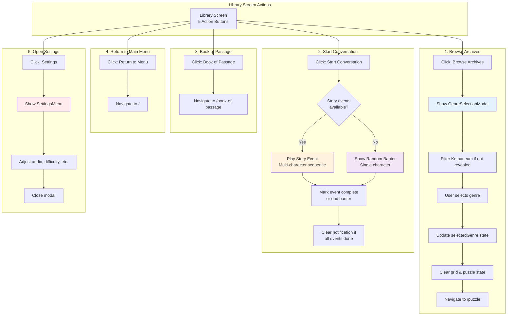

## Genre Selection Flow

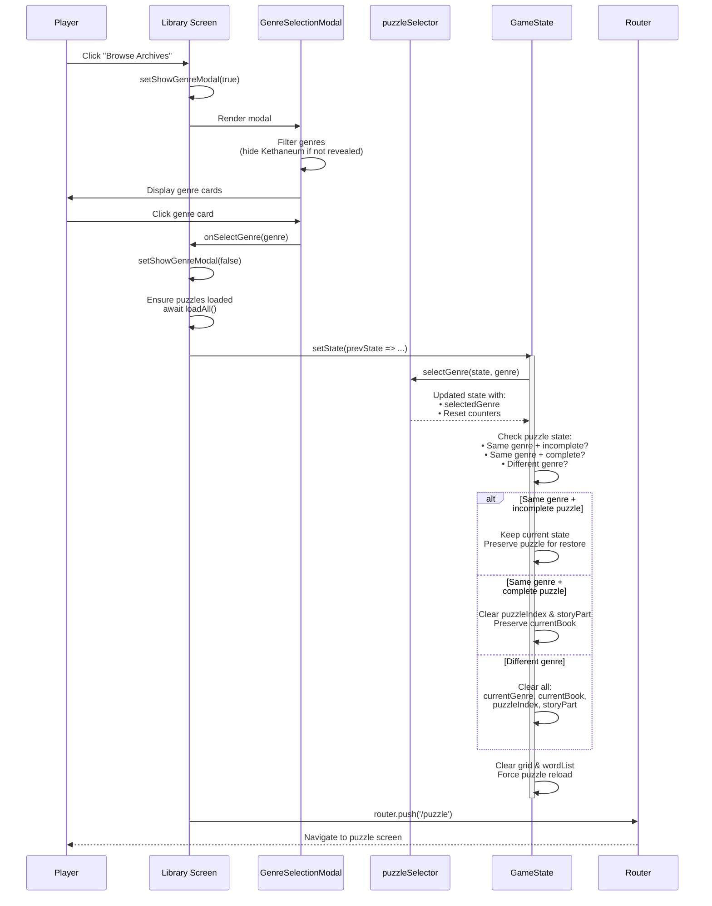

## Conversation System: Story Event vs Banter

```mermaid
graph TB
    Start[Click: Start Conversation]

    Start --> SetActive[setConversationActive true]
    SetActive --> WaitQueue[Wait for DialogueQueue mount<br/>Ensure ref available]
    WaitQueue --> ClearQueue[Clear dialogue queue<br/>Remove old panels]

    ClearQueue --> GetBeat[Get currentStoryBeat from state]
    GetBeat --> CheckEvents{Story events<br/>available?}

    CheckEvents -->|Use EventChecker| GetCompleted[Get completedStoryEvents<br/>Union of state + ref]
    GetCompleted --> QueryEvents[dialogueManager.getAvailableStoryEvent]

    QueryEvents --> HasEvent{Event<br/>available?}

    HasEvent -->|Yes| PlayEvent[Play Story Event]
    HasEvent -->|No| PlayBanter[Play Random Banter]

    PlayEvent --> CreatePlayer[new StoryEventPlayer]
    PlayEvent --> SetupCallbacks[Setup callbacks:<br/>• onDialogue<br/>• onCompleted]
    SetupCallbacks --> LoadEvent[player.loadStoryEvent id]
    LoadEvent --> ValidateEvent{Event valid?}
    ValidateEvent -->|No| ErrorCleanup[Clean up & end]
    ValidateEvent -->|Yes| StartPlayer[player.start]
    StartPlayer --> PreloadPortraits[Preload portraits<br/>Background, non-blocking]
    PreloadPortraits --> EmitDialogue[Emit dialogue entries<br/>to queue]

    PlayBanter --> GetBanter[dialogueManager.getRandomBanter beat]
    GetBanter --> GetCharacter[Get character data]
    GetCharacter --> ChunkBanter[chunkText dialogue.text]
    ChunkBanter --> BuildEntry[Build DialogueEntry]
    BuildEntry --> AddToQueue[Add to dialogue queue]

    EmitDialogue --> ShowDialogue[Display in DialogueQueue]
    AddToQueue --> ShowDialogue
    ShowDialogue --> WaitContinue[Wait for player to continue]

    WaitContinue --> ContinueClick[Click Continue]
    ContinueClick --> CheckType{Story Event<br/>or Banter?}

    CheckType -->|Story Event| AdvancePlayer[eventPlayer.advance]
    CheckType -->|Banter| EndBanter[Clear queue & end]

    AdvancePlayer --> MoreDialogue{More dialogue?}
    MoreDialogue -->|Yes| EmitDialogue
    MoreDialogue -->|No| OnComplete[player.onCompleted]

    OnComplete --> MarkComplete[Mark event as completed<br/>in completedStoryEvents]
    MarkComplete --> UpdateRef[Update completedEventsRef]
    UpdateRef --> CheckRemaining{More unlocked<br/>events?}
    CheckRemaining -->|No| ClearNotif[clearNewDialogue]
    CheckRemaining -->|Yes| KeepNotif[Keep notification]
    ClearNotif --> EndConv[End conversation]
    KeepNotif --> EndConv
    EndBanter --> EndConv

    EndConv --> SetInactive[setConversationActive false]

    style PlayEvent fill:#fff3e0
    style PlayBanter fill:#f3e5f5
    style MarkComplete fill:#c8e6c9
    style ClearNotif fill:#e3f2fd
```

## Story Event Playback Detailed Flow

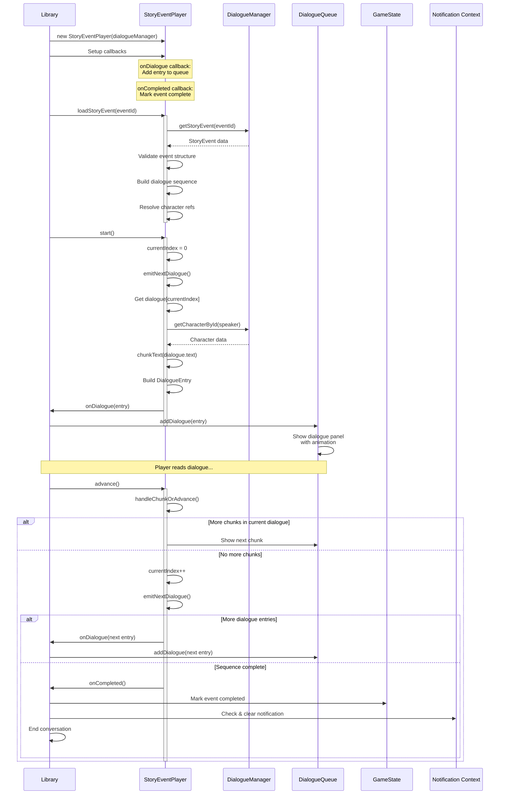

## Notification System Integration

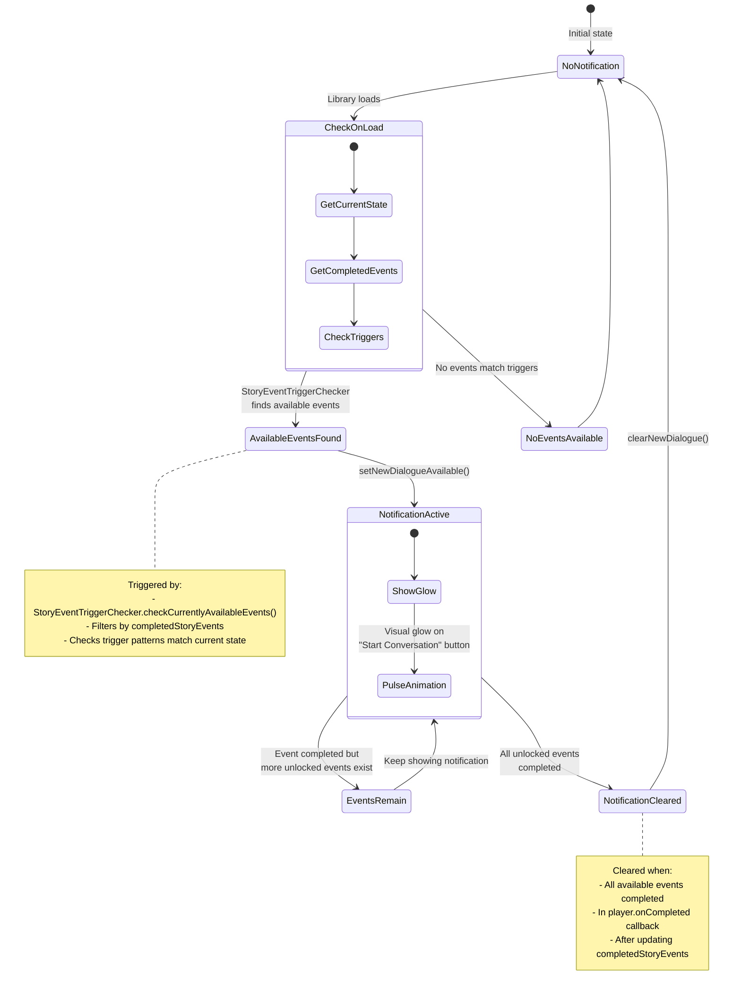

## State Management & Refs

```mermaid
graph TB
    subgraph "React State"
        StateConv[conversationActive: boolean]
        StateModal[showGenreModal: boolean]
        StateSettings[showSettingsMenu: boolean]
    end

    subgraph "React Refs"
        RefQueue[dialogueQueueRef<br/>Access to queue methods]
        RefPlayer[eventPlayerRef<br/>Current story event player]
        RefEventId[currentEventIdRef<br/>Event being played]
        RefCompleted[completedEventsRef<br/>Sync copy of completedStoryEvents]
    end

    subgraph "GameState (Persisted)"
        GS_Completed[dialogue.completedStoryEvents: string[]]
        GS_Visited[dialogue.hasVisitedLibrary: boolean]
        GS_Genre[selectedGenre: string]
        GS_Puzzles[puzzles, currentGenre, etc.]
    end

    subgraph "Synchronization"
        SyncEffect[useEffect:<br/>Sync ref ↔ state]
        ValidateEffect[useEffect:<br/>Validate consistency]
    end

    RefCompleted -.->|Updates| GS_Completed
    GS_Completed -.->|Loads| RefCompleted

    SyncEffect --> RefCompleted
    SyncEffect --> GS_Completed

    ValidateEffect --> RefCompleted
    ValidateEffect --> GS_Completed

    RefQueue -.->|Calls| DialogueQueue
    RefPlayer -.->|Calls| EventPlayer
    RefEventId -.->|Tracks| CurrentEvent

    StateConv -->|Controls| DialogueQueue
    StateModal -->|Controls| GenreModal
    StateSettings -->|Controls| SettingsModal

    style RefCompleted fill:#fff9c4
    style GS_Completed fill:#c8e6c9
    style SyncEffect fill:#e3f2fd
```

## Completed Events Tracking System

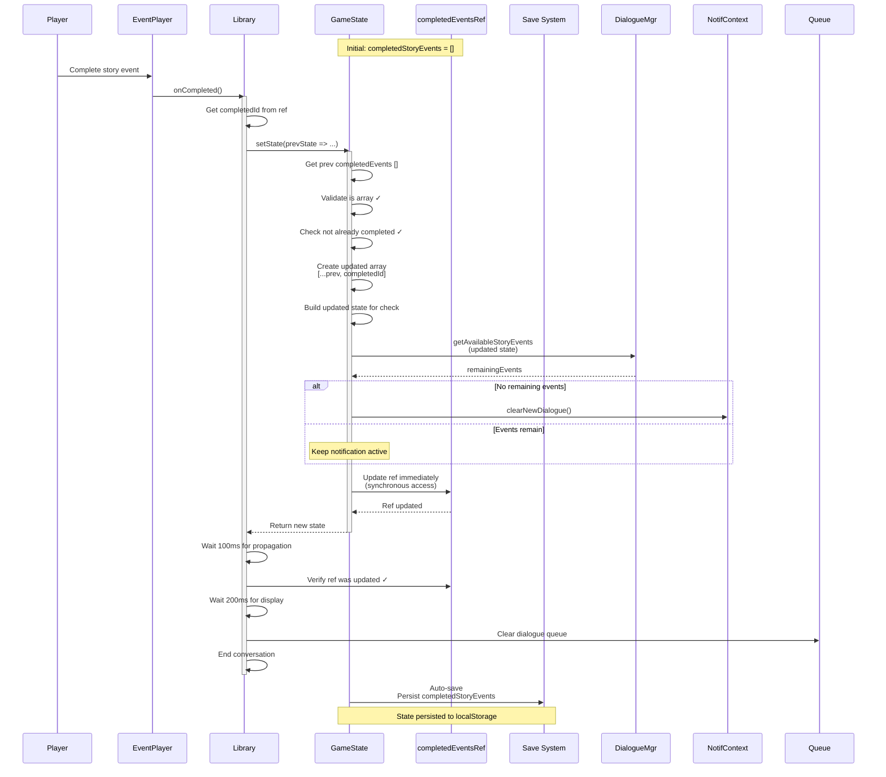

## Genre Selection State Handling

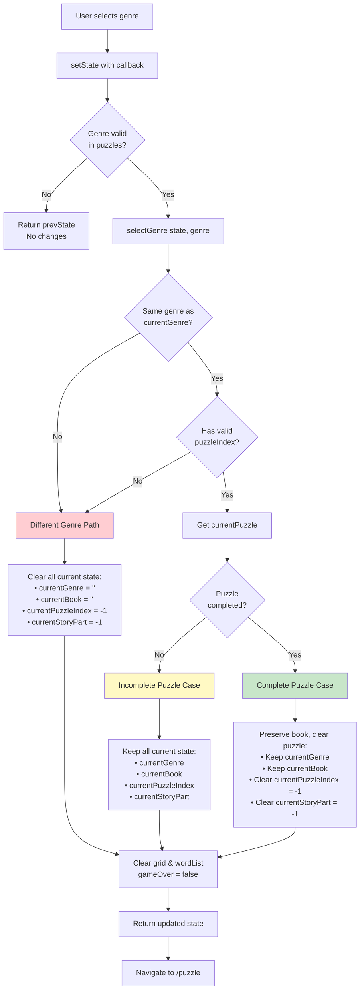

## Access Control & Loading States

```mermaid
graph TB
    Start[Navigate to /library]

    Start --> CheckMode{gameMode === 'story'?}

    CheckMode -->|No| Redirect[Redirect to /puzzle<br/>Library is Story mode only]
    CheckMode -->|Yes| CheckLoading{Dependencies ready?}

    CheckLoading -->|No| ShowLoader[Display PageLoader<br/>"Loading Library Archives..."]
    CheckLoading -->|Yes| DisplayLibrary[Display Library Screen]

    ShowLoader --> CheckDeps[Check dependencies:<br/>• gameStateReady<br/>• isInitialized (dialogue)<br/>• puzzles loaded<br/>• storyProgress ready]

    CheckDeps --> CheckLoading

    DisplayLibrary --> InitDialogue[Initialize dialogue system<br/>if not initialized]
    InitDialogue --> LoadPuzzles{Puzzles loaded?}
    LoadPuzzles -->|No| LoadAll[loadAll puzzles]
    LoadPuzzles -->|Yes| CheckNotif[Check for available events<br/>Set notification state]

    LoadAll --> CheckNotif
    CheckNotif --> Ready[Library ready for interaction]

    style Redirect fill:#ffcdd2
    style ShowLoader fill:#fff9c4
    style Ready fill:#c8e6c9
```

## Dialogue Queue Lifecycle

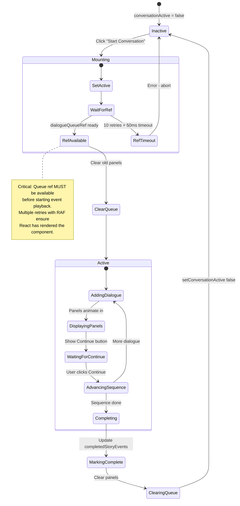

## Banter vs Story Event Comparison

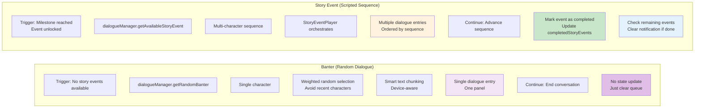

## Integration Points

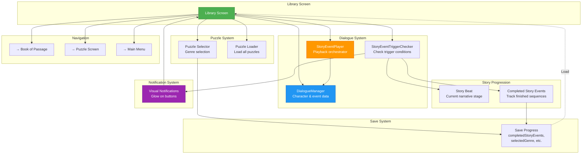

## Key Features & Behaviors

```mermaid
graph LR
    subgraph "Features"
        F1[Five Action Buttons<br/>Browse | Converse | Book | Menu | Settings]
        F2[Smart Conversation Routing<br/>Story events prioritized over banter]
        F3[Story Event Tracking<br/>Never replay completed events]
        F4[Kethaneum Reveal<br/>Hidden until first encounter]
        F5[Visual Notifications<br/>Glow for new events]
        F6[Ref + State Sync<br/>Reliable completion tracking]
        F7[Story Mode Only<br/>Auto-redirect other modes]
        F8[Weighted Banter<br/>Avoid repetition]
    end

    subgraph "Behaviors"
        B1[Clear Queue on Start<br/>No stale dialogue]
        B2[Wait for Ref Mount<br/>Ensure queue ready]
        B3[Immediate Ref Update<br/>Synchronous access]
        B4[Notification Persistence<br/>Survives page refresh]
        B5[State Validation<br/>Check array integrity]
        B6[Error Recovery<br/>Clean up on failure]
        B7[Portrait Preloading<br/>Background, non-blocking]
        B8[Chunked Text Display<br/>Device-aware]
    end

    style F2 fill:#fff3e0
    style F3 fill:#c8e6c9
    style F5 fill:#e3f2fd
    style B3 fill:#fff9c4
    style B4 fill:#ffebee
    style B6 fill:#ffcdd2
```

## Error Handling & Recovery

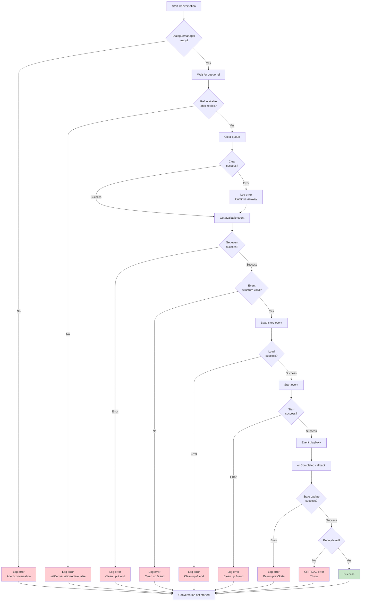

## Performance Characteristics

- **Page Load**: ~200-1000ms (depends on puzzle data size)
- **Dialogue System Init**: ~50-200ms (character & event loading)
- **Puzzle Load (All Genres)**: ~100-500ms (parallel fetch)
- **Genre Selection**: ~1-5ms (state update)
- **Event Trigger Check**: ~1-5ms (indexed by story beat)
- **Banter Selection**: ~1-5ms (weighted random)
- **Story Event Load**: ~10-50ms (resolve characters, build sequence)
- **Dialogue Entry Display**: ~500ms (panel animation)
- **Ref Wait Retries**: ~10-60ms (requestAnimationFrame × 10)
- **State Save Propagation**: ~100-200ms (debounced)

## Testing Considerations

Key areas to test when modifying the Library Screen:

1. **Genre Selection**
   - Kethaneum hidden until revealed
   - Genre state updates correctly
   - Puzzle state cleared/preserved appropriately
   - Navigation to puzzle screen works

2. **Story Event System**
   - Events trigger on correct conditions
   - Completed events never replay
   - Ref and state stay synchronized
   - Notification clears when all events done
   - Multi-character sequences play in order

3. **Banter System**
   - Displays when no events available
   - Weighted selection avoids repetition
   - Text chunking works correctly
   - Single panel display

4. **Notification System**
   - Glow appears on new events
   - Survives page refresh
   - Clears when all events complete
   - Respects completed events list

5. **Queue Management**
   - Queue clears before new conversation
   - Ref available before playback starts
   - Panels animate correctly
   - Continue button advances properly

6. **State Persistence**
   - completedStoryEvents saves
   - hasVisitedLibrary sets on first-visit
   - selectedGenre persists
   - Ref syncs with state on load

7. **Error Recovery**
   - Graceful degradation on errors
   - Cleanup on failure
   - No stuck conversation states
   - Validation prevents corruption

## Future Considerations

1. **Character Profiles**: View detailed character bios from library
2. **Event History**: Replay completed story events
3. **Achievement Integration**: Library-specific achievements
4. **Quest System**: Track objectives from the library
5. **Reading Nook**: Read completed book excerpts in library
6. **Librarian Guide**: Tutorial/hint character in library
7. **Bookshelf Visualization**: 3D bookshelf with books
8. **Character Portraits**: Display during conversations
9. **Voice Acting**: Audio narration for events
10. **Parallel Conversations**: Multiple characters talking simultaneously
