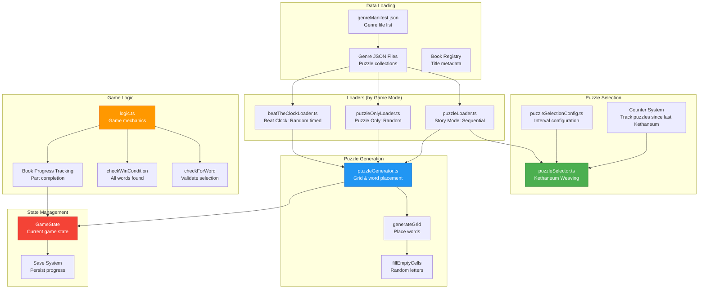
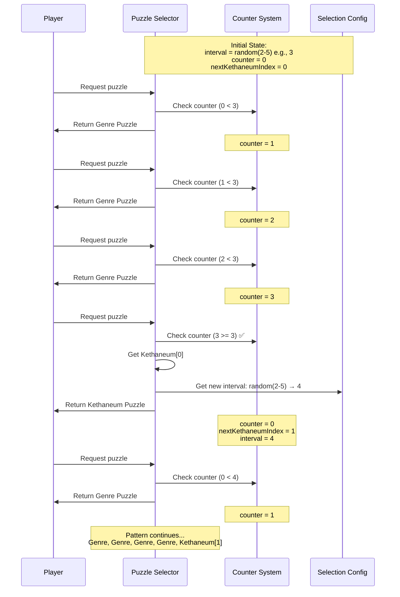
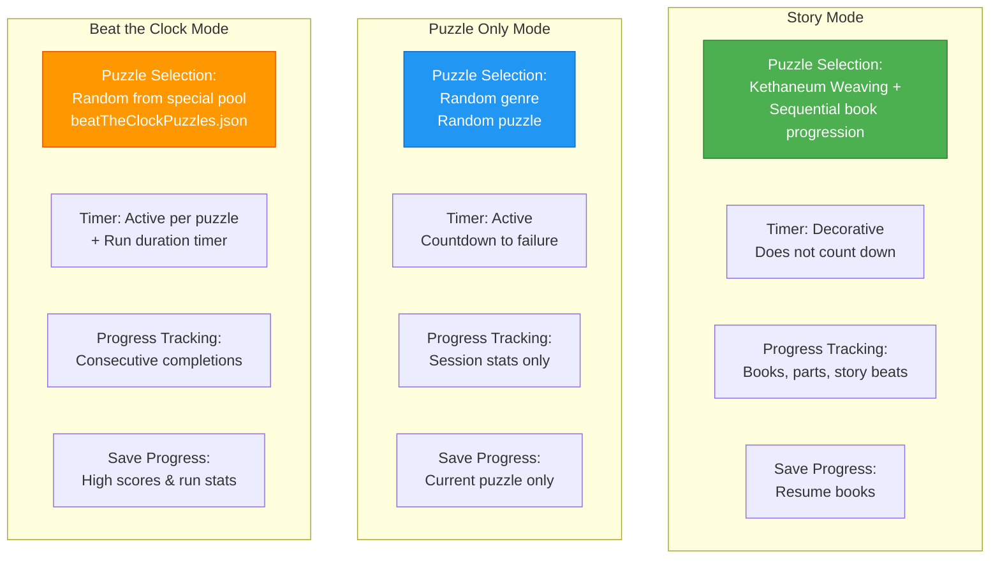
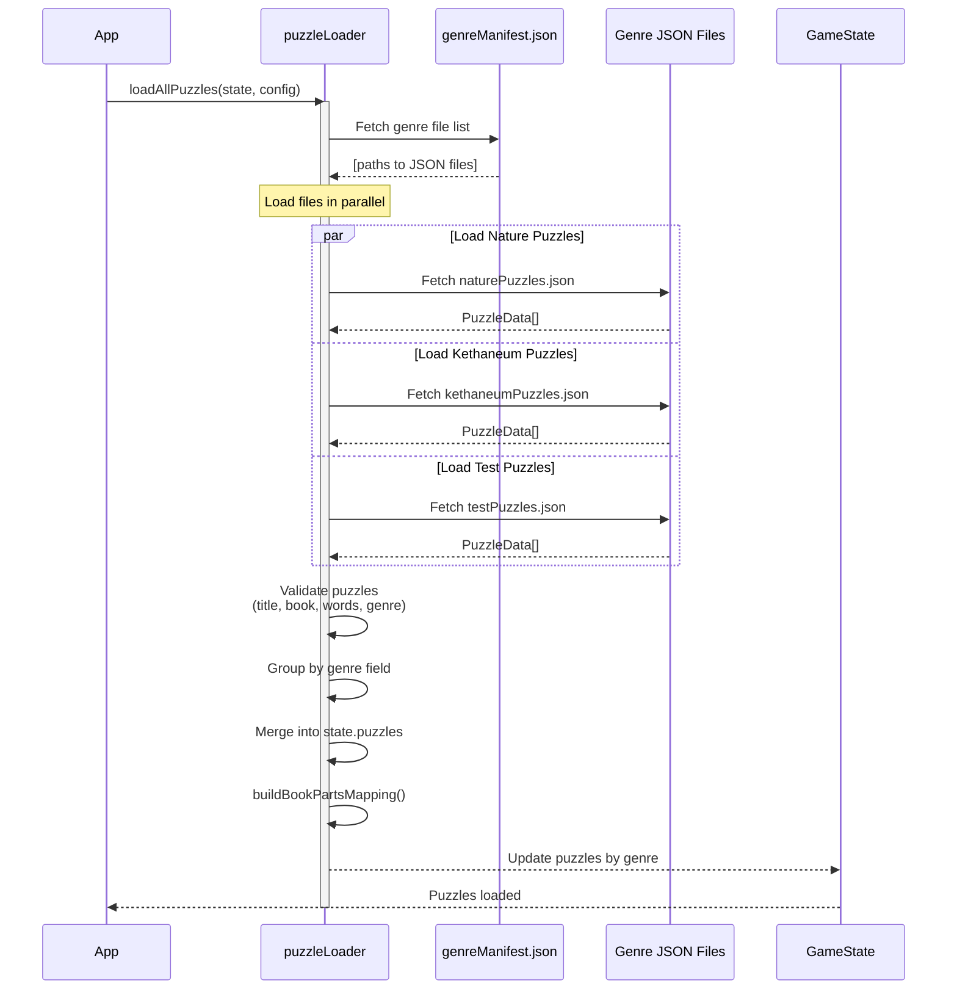
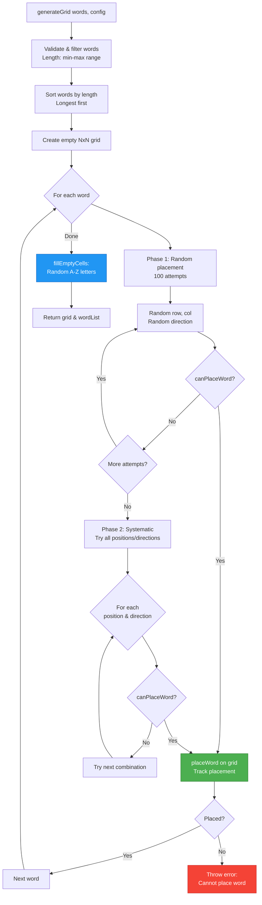
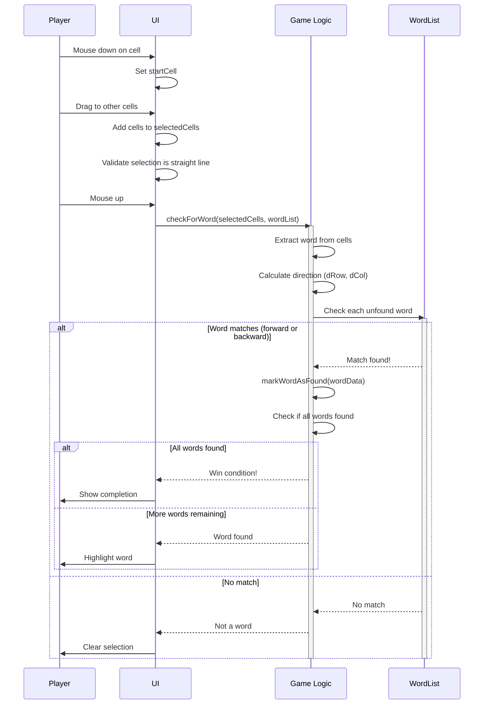
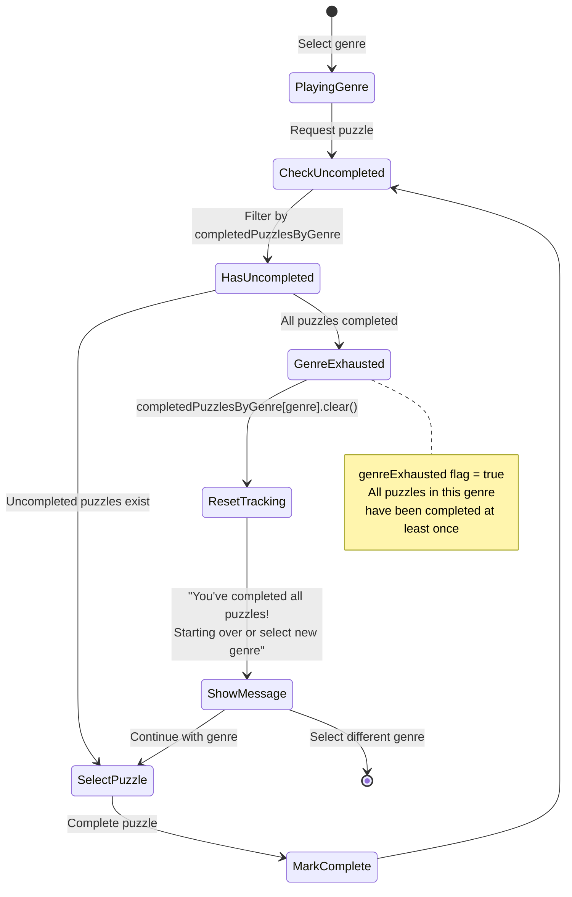
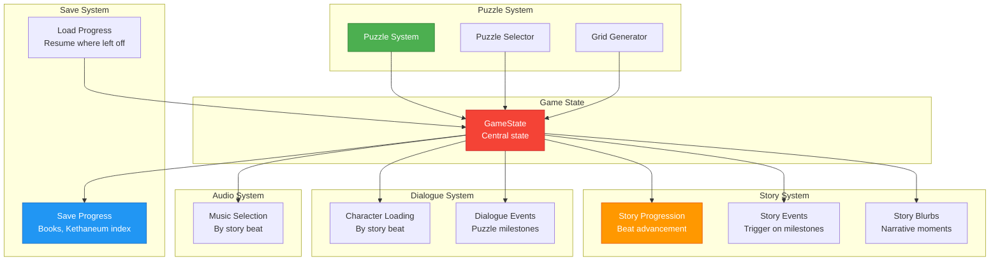

# Puzzle System Architecture Diagram

## Overview
The Chronicles of the Kethaneum puzzle system manages word search puzzle generation, selection, and game modes. It features intelligent **Kethaneum weaving** (narrative puzzle insertion), sequential book progression, and three distinct game modes with different selection strategies.

## Main Architecture



## Puzzle Selection Flow (Story Mode with Kethaneum Weaving)

```mermaid
graph TB
    Start[selectNextPuzzle]

    Start --> ValidateGenre{Selected<br/>genre valid?}
    ValidateGenre -->|No| ErrorNoGenre[Return error:<br/>Please select genre]
    ValidateGenre -->|Yes| CheckKethTime{Time for<br/>Kethaneum?}

    CheckKethTime --> CheckCounter{puzzlesSinceLastKethaneum<br/>>= interval?}
    CheckCounter -->|No| SelectGenre[selectGenrePuzzle]
    CheckCounter -->|Yes| CheckKethAvail{Kethaneum<br/>puzzles available?}

    CheckKethAvail -->|Yes| SelectKeth[selectKethaneumPuzzle]
    CheckKethAvail -->|No| SelectGenre

    SelectKeth --> KethIndex{nextKethaneumIndex<br/>< total puzzles?}
    KethIndex -->|No| KethExhausted[Kethaneum exhausted]
    KethIndex -->|Yes| GetKeth[Get puzzle at<br/>nextKethaneumIndex]

    GetKeth --> UpdateKeth[Update state:<br/>• nextKethaneumIndex++<br/>• puzzlesSinceLastKethaneum = 0<br/>• nextKethaneumInterval = random(2-5)<br/>• kethaneumRevealed = true]

    UpdateKeth --> ReturnKeth[Return Kethaneum puzzle]
    KethExhausted --> SelectGenre

    SelectGenre --> CheckCompleted{Get uncompleted<br/>puzzles}
    CheckCompleted --> HasUncompleted{Any uncompleted?}

    HasUncompleted -->|Yes| CheckCurrentBook{currentBook<br/>has uncompleted?}
    HasUncompleted -->|No| ResetGenre[Reset completedPuzzlesByGenre<br/>genreExhausted = true]

    CheckCurrentBook -->|Yes| SelectLowestPart[Select lowest<br/>uncompleted part]
    CheckCurrentBook -->|No| SelectNewBook[selectNewBook:<br/>Random from lowest parts]

    ResetGenre --> RandomPuzzle[Select random puzzle]

    SelectLowestPart --> UpdateGenre[Update state:<br/>• puzzlesSinceLastKethaneum++<br/>• currentGenre, currentBook<br/>• currentStoryPart, currentPuzzleIndex]

    SelectNewBook --> UpdateGenre
    RandomPuzzle --> UpdateGenre

    UpdateGenre --> ReturnGenre[Return genre puzzle]

    style SelectKeth fill:#9C27B0,stroke:#6A1B9A,color:#fff
    style SelectGenre fill:#2196F3,stroke:#1565C0,color:#fff
    style UpdateKeth fill:#4CAF50,stroke:#2E7D32,color:#fff
    style UpdateGenre fill:#4CAF50,stroke:#2E7D32,color:#fff
```

## Kethaneum Weaving Pattern



## Game Modes Comparison



## Puzzle Data Loading Flow



## Grid Generation Algorithm



## Word Placement Validation

```mermaid
graph TB
    subgraph "canPlaceWord Check"
        Start[canPlaceWord<br/>grid, word, row, col, dRow, dCol]

        Start --> CalcEnd[Calculate end position:<br/>endRow = row + (len-1) * dRow<br/>endCol = col + (len-1) * dCol]

        CalcEnd --> CheckBounds{End position<br/>in bounds?}
        CheckBounds -->|No| ReturnFalse1[Return false]
        CheckBounds -->|Yes| CheckCells[Check each cell in path]

        CheckCells --> LoopCells{For each letter}
        LoopCells --> GetCell[Get cell at<br/>row + i*dRow, col + i*dCol]
        GetCell --> CellCheck{Cell empty OR<br/>matches letter?}

        CellCheck -->|No| ReturnFalse2[Return false]
        CellCheck -->|Yes| NextCell[Next letter]
        NextCell --> LoopCells

        LoopCells -->|Done| ReturnTrue[Return true]
    end

    subgraph "Directions"
        D1["[0, 1] → Right"]
        D2["[1, 0] ↓ Down"]
        D3["[1, 1] ↘ Diagonal down-right"]
        D4["[0, -1] ← Left"]
        D5["[-1, 0] ↑ Up"]
        D6["[-1, -1] ↖ Diagonal up-left"]
        D7["[1, -1] ↙ Diagonal down-left"]
        D8["[-1, 1] ↗ Diagonal up-right"]
    end

    style ReturnTrue fill:#c8e6c9
    style ReturnFalse1 fill:#ffcdd2
    style ReturnFalse2 fill:#ffcdd2
```

## Book Progression System

```mermaid
graph TB
    subgraph "Book Structure"
        Book[Book Title]
        Parts[Story Parts: 0-4]
        P0[Part 0: Hook/Introduction]
        P1[Part 1: Rising Action]
        P2[Part 2: Midpoint Twist]
        P3[Part 3: Climactic Moment]
        P4[Part 4: Resolution/Epilogue]
    end

    subgraph "Progression Logic"
        LoadPuzzle[Load puzzle]
        CheckBook{Current book<br/>has uncompleted parts?}

        CheckBook -->|Yes| GetLowest[Get lowest<br/>uncompleted part]
        CheckBook -->|No| PickNewBook[Pick new book<br/>from genre]

        GetLowest --> LoadPart[Load that part's puzzle]
        PickNewBook --> GetLowestNew[Get lowest part<br/>of new book]
        GetLowestNew --> LoadPart

        LoadPart --> CompletePuzzle[User completes puzzle]
        CompletePuzzle --> MarkComplete[Mark part as complete:<br/>books[title][part] = true]

        MarkComplete --> CheckAllParts{All parts<br/>complete?}
        CheckAllParts -->|Yes| MarkBookComplete[Mark book complete]
        CheckAllParts -->|No| NextPuzzle[Next puzzle request]
        MarkBookComplete --> NextPuzzle
        NextPuzzle --> CheckBook
    end

    Book --> Parts
    Parts --> P0
    Parts --> P1
    Parts --> P2
    Parts --> P3
    Parts --> P4

    LoadPuzzle --> CheckBook

    style GetLowest fill:#4CAF50,stroke:#2E7D32,color:#fff
    style MarkComplete fill:#2196F3,stroke:#1565C0,color:#fff
    style MarkBookComplete fill:#9C27B0,stroke:#6A1B9A,color:#fff
```

## Word Finding System



## Data Structures

```mermaid
graph TB
    subgraph "PuzzleData (JSON)"
        PD[PuzzleData]
        PD_Title[title: string<br/>Unique identifier]
        PD_Book[book: string<br/>Book title]
        PD_Part[storyPart: number<br/>0-4: narrative arc]
        PD_Genre[genre: string<br/>Category/theme]
        PD_Words[words: string[]<br/>Words to find]
        PD_Hint[hint?: string<br/>Optional clue]
    end

    subgraph "WordData (Runtime)"
        WD[WordData]
        WD_Word[word: string<br/>Uppercase]
        WD_Found[found: boolean<br/>Completion status]
        WD_Row[row: number<br/>Start position]
        WD_Col[col: number<br/>Start position]
        WD_Dir[direction: [number, number]<br/>[dRow, dCol]]
    end

    subgraph "GameState"
        GS[GameState]
        GS_Grid[grid: string[][]<br/>Letter matrix]
        GS_WordList[wordList: WordData[]<br/>Placed words]
        GS_Puzzles[puzzles: {[genre]: PuzzleData[]}<br/>All loaded puzzles]
        GS_Books[books: {[title]: boolean[]}<br/>Part completion tracking]
        GS_Current[currentGenre, currentBook<br/>currentStoryPart, currentPuzzleIndex]
        GS_Keth[nextKethaneumIndex: number<br/>puzzlesSinceLastKethaneum: number<br/>nextKethaneumInterval: number<br/>kethaneumRevealed: boolean]
        GS_Progress[completedPuzzles: number<br/>completedBooks: number<br/>discoveredBooks: Set<string>]
        GS_Completed[completedPuzzlesByGenre:<br/>{[genre]: Set<string>}]
    end

    subgraph "PuzzleSelectionResult"
        PSR[PuzzleSelectionResult]
        PSR_Puzzle[puzzle: PuzzleData | null]
        PSR_State[newState: GameState]
        PSR_Keth[isKethaneum: boolean]
        PSR_GenExh[genreExhausted: boolean]
        PSR_KethExh[kethaneumExhausted: boolean]
        PSR_Msg[message?: string]
    end

    PD --> PD_Title
    PD --> PD_Book
    PD --> PD_Part
    PD --> PD_Genre
    PD --> PD_Words
    PD --> PD_Hint

    WD --> WD_Word
    WD --> WD_Found
    WD --> WD_Row
    WD --> WD_Col
    WD --> WD_Dir

    GS --> GS_Grid
    GS --> GS_WordList
    GS --> GS_Puzzles
    GS --> GS_Books
    GS --> GS_Current
    GS --> GS_Keth
    GS --> GS_Progress
    GS --> GS_Completed

    PSR --> PSR_Puzzle
    PSR --> PSR_State
    PSR --> PSR_Keth
    PSR --> PSR_GenExh
    PSR --> PSR_KethExh
    PSR --> PSR_Msg

    style PD fill:#fff3e0
    style WD fill:#e3f2fd
    style GS fill:#ffebee
    style PSR fill:#f3e5f5
```

## Puzzle Completion Flow

```mermaid
graph TB
    Start[All words found]

    Start --> EndGame[endGame win = true]
    EndGame --> ClearTimer[Clear puzzle timer]
    ClearTimer --> IncrCount[completedPuzzles++]

    IncrCount --> MarkPart[books[currentBook][currentStoryPart] = true]
    MarkPart --> AddDiscovered{Book in<br/>discoveredBooks?}

    AddDiscovered -->|No| AddBook[discoveredBooks.add book<br/>completedBooks = set.size]
    AddDiscovered -->|Yes| SkipAdd[Skip add]

    AddBook --> CheckBookDone{All parts<br/>of book complete?}
    SkipAdd --> CheckBookDone

    CheckBookDone -->|Yes| MarkBookComp[Mark book.complete = true]
    CheckBookDone -->|No| CheckStory[Check story progression]

    MarkBookComp --> CheckStory
    CheckStory --> BuildMetrics[Build ProgressionMetrics:<br/>• completedPuzzles<br/>• discoveredBooks<br/>• completedBooks]

    BuildMetrics --> StoryCheck[storyProgressionManager<br/>.checkAndAdvanceStory]

    StoryCheck --> ShouldAdvance{Should advance<br/>story beat?}
    ShouldAdvance -->|Yes| AdvanceBeat[Advance to new beat<br/>Update music, characters, events]
    ShouldAdvance -->|No| Stay[Stay on current beat]

    AdvanceBeat --> Save[Save progress]
    Stay --> Save

    Save --> End[Return to game]

    style MarkPart fill:#4CAF50,stroke:#2E7D32,color:#fff
    style CheckStory fill:#FF9800,stroke:#E65100,color:#fff
    style AdvanceBeat fill:#9C27B0,stroke:#6A1B9A,color:#fff
```

## Genre Exhaustion & Reset



## Kethaneum Pattern Configuration

```mermaid
graph LR
    subgraph "puzzleSelectionConfig.ts"
        Config[PuzzleSelectionConfig]
        MinInterval[minPuzzlesBeforeKethaneum: 2]
        MaxInterval[maxPuzzlesBeforeKethaneum: 5]
        KethName[kethaneumGenreName: 'Kethaneum']
    end

    subgraph "Random Interval Generator"
        GetInterval[getRandomKethaneumInterval]
        Calculate[Random between min and max<br/>Math.random() * (5-2+1) + 2<br/>Result: 2, 3, 4, or 5]
    end

    subgraph "Pattern Examples"
        E1[Pattern 1: G,G,K,G,G,G,G,K<br/>intervals: 2, 4]
        E2[Pattern 2: G,G,G,K,G,G,G,G,G,K<br/>intervals: 3, 5]
        E3[Pattern 3: G,G,G,G,G,K,G,G,K<br/>intervals: 5, 2]
    end

    Config --> MinInterval
    Config --> MaxInterval
    Config --> KethName

    MinInterval --> GetInterval
    MaxInterval --> GetInterval
    GetInterval --> Calculate

    Calculate --> E1
    Calculate --> E2
    Calculate --> E3

    style Config fill:#fff3e0
    style Calculate fill:#4CAF50,stroke:#2E7D32,color:#fff
```

## Integration Points



## File Structure

```mermaid
graph TB
    subgraph "Data Files"
        Manifest[/data/genreManifest.json<br/>List of genre files to load]
        GenreJSON[/data/story-puzzles/*.json<br/>Puzzle collections by theme]
        BeatJSON[/data/beat-the-clock-mode-puzzles/<br/>beatTheClockPuzzles.json]
    end

    subgraph "Core System Files"
        Selector[lib/game/puzzleSelector.ts<br/>Kethaneum weaving logic]
        Config[lib/game/puzzleSelectionConfig.ts<br/>Interval configuration]
        Generator[lib/game/puzzleGenerator.ts<br/>Grid generation & word placement]
        Loader[lib/game/puzzleLoader.ts<br/>Story mode sequential loading]
        PuzzleOnly[lib/game/puzzleOnlyLoader.ts<br/>Random puzzle loading]
        BeatLoader[lib/game/beatTheClockLoader.ts<br/>Beat clock puzzle loading]
        Logic[lib/game/logic.ts<br/>Game mechanics & win conditions]
        State[lib/game/state.ts<br/>TypeScript interfaces]
    end

    subgraph "React Hooks"
        UsePuzzle[hooks/usePuzzle.ts<br/>Puzzle state management]
        UsePuzzleLoad[hooks/usePuzzleLoading.ts<br/>Puzzle loading orchestration]
        UseGameLogic[hooks/useGameLogic.ts<br/>Game logic integration]
        UseTimer[hooks/useTimer.ts<br/>Timer management]
    end

    subgraph "UI Components"
        GameScreen[Game Screen Components<br/>Grid, word list, timer]
        Library[Library Component<br/>Genre selection]
    end

    Manifest --> Loader
    GenreJSON --> Loader
    BeatJSON --> BeatLoader

    Selector --> Config
    Selector --> Loader
    Generator --> Loader
    Generator --> PuzzleOnly
    Generator --> BeatLoader

    Logic --> State
    Selector --> State
    Generator --> State

    Loader --> UsePuzzleLoad
    PuzzleOnly --> UsePuzzleLoad
    BeatLoader --> UsePuzzleLoad

    UsePuzzle --> UseGameLogic
    UseTimer --> UseGameLogic
    UsePuzzleLoad --> GameScreen
    UseGameLogic --> GameScreen

    Library --> Selector

    style Manifest fill:#fff3e0
    style GenreJSON fill:#fff3e0
    style Selector fill:#4CAF50,stroke:#2E7D32,color:#fff
    style Generator fill:#2196F3,stroke:#1565C0,color:#fff
    style Logic fill:#FF9800,stroke:#E65100,color:#fff
```

## Testing Considerations

Key areas to test when modifying the puzzle system:

1. **Puzzle Selection**
   - Kethaneum weaving pattern (correct intervals)
   - Genre exhaustion and reset
   - Book progression (sequential parts)
   - Completed puzzle tracking

2. **Grid Generation**
   - All words placed successfully
   - Words don't overlap incorrectly
   - Grid bounds respected
   - Empty cells filled

3. **Word Finding**
   - Forward and backward matching
   - All 8 directions work
   - Invalid selections rejected
   - Win condition triggers correctly

4. **Game Modes**
   - Story: Sequential, decorative timer
   - Puzzle Only: Random, active timer
   - Beat Clock: Special pool, dual timers

5. **Book Tracking**
   - Parts marked complete correctly
   - Book completion detected
   - Progress persists across saves
   - Sequential part loading

6. **State Management**
   - Kethaneum counter resets correctly
   - Genre switching maintains state
   - Save/load preserves all fields
   - Mode switching doesn't corrupt state

## Performance Characteristics

- **Puzzle Loading**: ~100-500ms (depends on # of genres)
- **Grid Generation**: ~10-50ms (depends on grid size, word count)
- **Word Check**: <1ms (simple string comparison)
- **Genre Selection**: ~1-5ms (set operations)
- **Kethaneum Check**: <1ms (counter comparison)
- **Book Progression**: ~1-5ms (array filtering)

## Future Considerations

1. **Adaptive Difficulty**: Adjust word lengths/grid size based on performance
2. **Daily Challenges**: Special curated puzzles with leaderboards
3. **Multiplayer**: Competitive or cooperative puzzle solving
4. **Hints System**: Progressive hints for stuck players
5. **Custom Puzzles**: User-created puzzle editor
6. **Achievements**: Milestone-based achievements for puzzle completion
7. **Puzzle Packs**: DLC or seasonal puzzle collections
8. **Speed Run Mode**: Time trials with global leaderboards
9. **Puzzle Analytics**: Track which words are hardest to find
10. **Accessibility**: Text-to-speech, colorblind modes, larger grids
