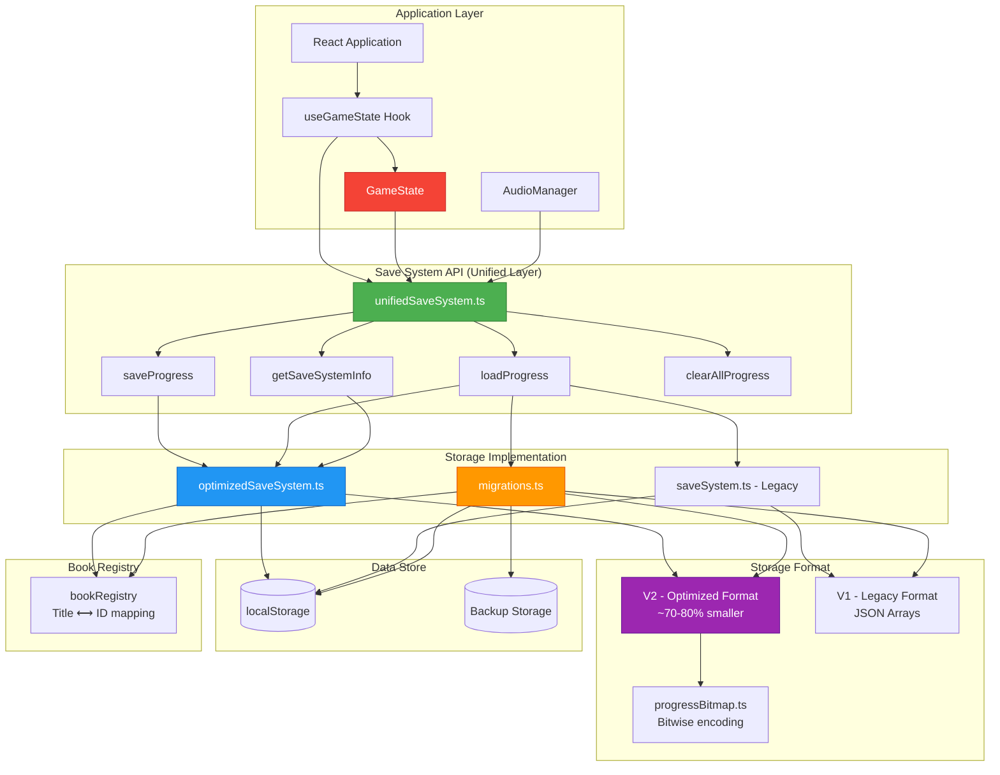
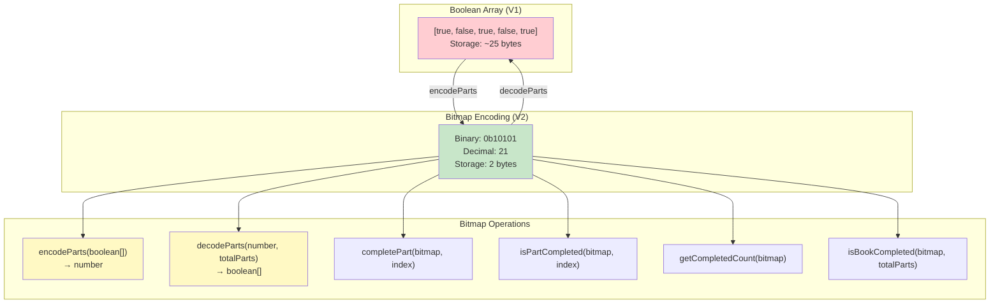
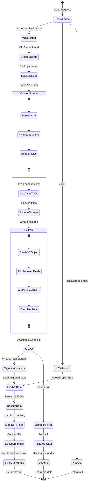
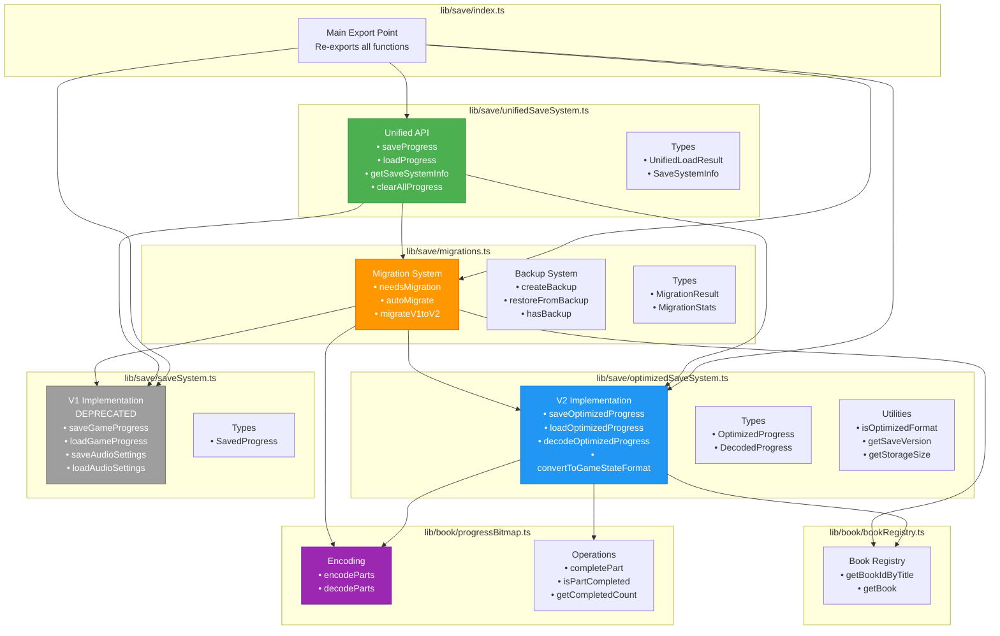
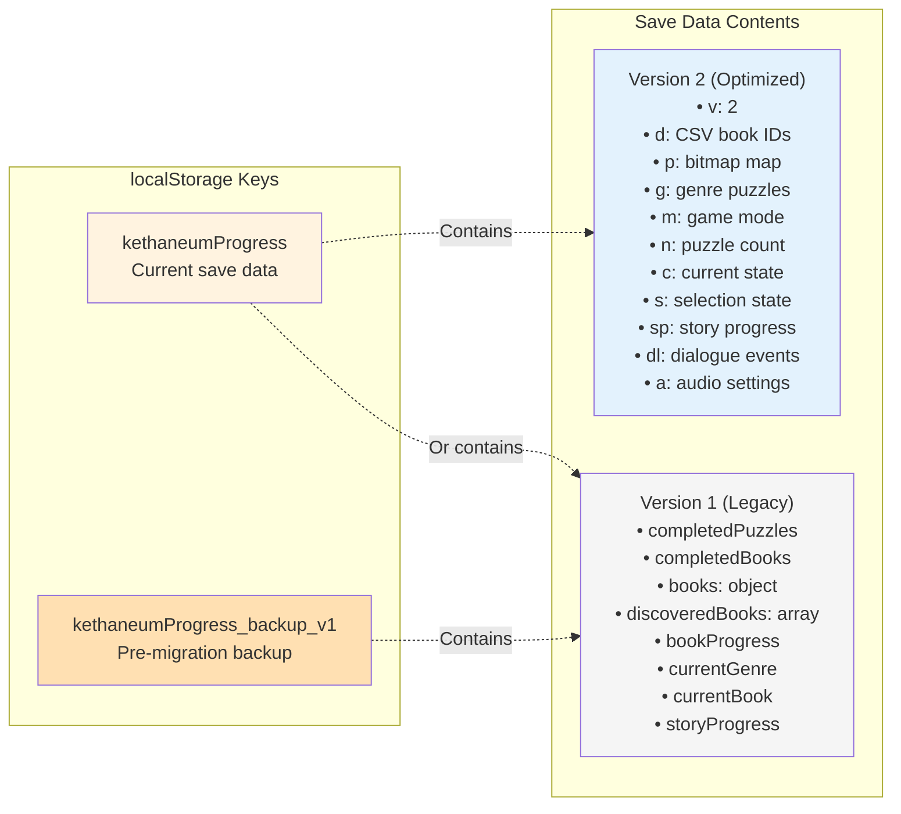
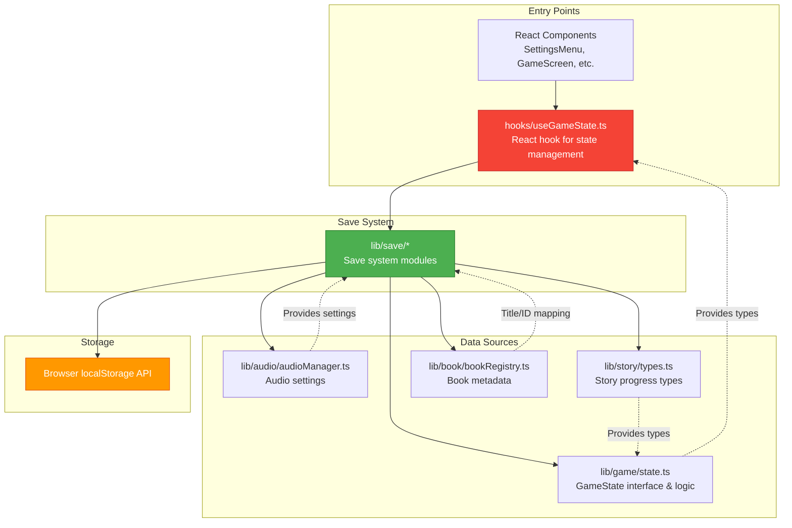
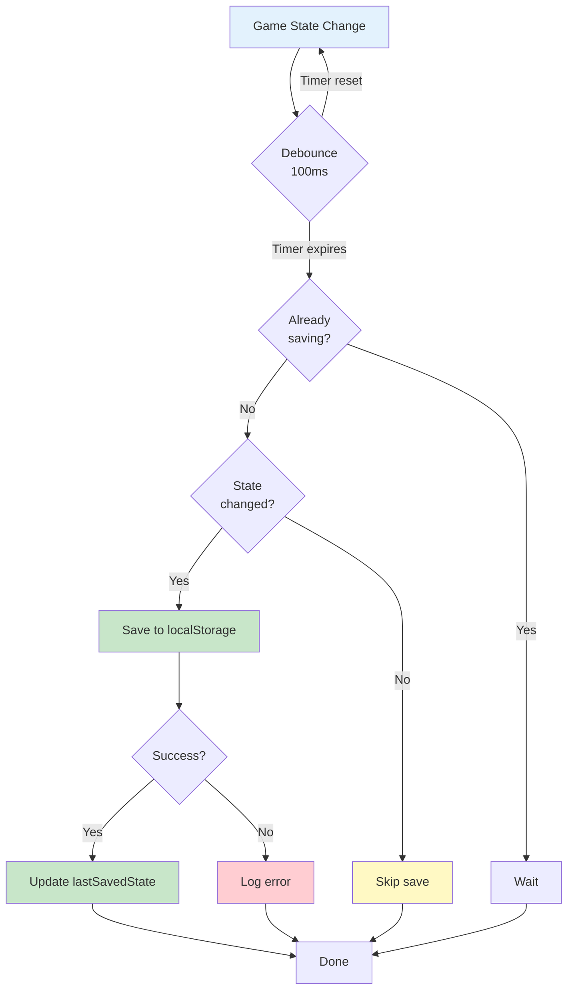
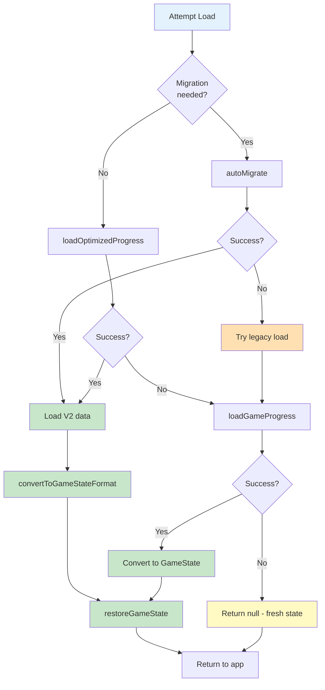

# Save System Architecture Diagram

## Overview
The Chronicles of the Kethaneum save system uses a three-layer architecture with automatic migration, backward compatibility, and optimized storage.

## Main Architecture



## Save Flow

```mermaid
sequenceDiagram
    participant App
    participant Hook as useGameState
    participant Unified as unifiedSaveSystem
    participant Opt as optimizedSaveSystem
    participant Bitmap as progressBitmap
    participant Registry as bookRegistry
    participant LS as localStorage

    App->>Hook: Update game state
    activate Hook
    Hook->>Hook: Detect state change
    Hook->>Hook: Debounce (100ms)
    Hook->>Unified: saveProgress(state)
    activate Unified

    Unified->>Opt: saveOptimizedProgress(state)
    activate Opt

    Opt->>Registry: Load registry
    Registry-->>Opt: Book ID mappings

    Opt->>Opt: Convert titles to IDs
    Opt->>Bitmap: encodeParts(boolean[])
    Bitmap-->>Opt: bitmap number

    Opt->>Opt: Build OptimizedProgress
    Note over Opt: Compact format with<br/>short property names

    Opt->>LS: setItem('kethaneumProgress', JSON)
    LS-->>Opt: Success

    deactivate Opt
    deactivate Unified
    deactivate Hook
```

## Load Flow with Migration

```mermaid
sequenceDiagram
    participant App
    participant Hook as useGameState
    participant Unified as unifiedSaveSystem
    participant Migration as migrations
    participant Opt as optimizedSaveSystem
    participant Legacy as saveSystem
    participant Bitmap as progressBitmap
    participant Registry as bookRegistry
    participant LS as localStorage
    participant Backup as Backup Storage

    App->>Hook: Initialize
    Hook->>Unified: loadProgress()
    activate Unified

    Unified->>Migration: needsMigration()
    Migration->>LS: Check version

    alt Old Format Detected (V1)
        Migration-->>Unified: true
        Unified->>Migration: autoMigrate()
        activate Migration

        Migration->>LS: Load old data
        LS-->>Migration: V1 Format JSON

        Migration->>Backup: createBackup()
        Backup-->>Migration: Backup created

        Migration->>Registry: Load registry
        Registry-->>Migration: Mappings

        Migration->>Migration: Convert titles to IDs
        Migration->>Bitmap: encodeParts()
        Bitmap-->>Migration: bitmaps

        Migration->>Migration: Build V2 format
        Migration->>LS: Save migrated data

        Migration-->>Unified: Success + stats
        deactivate Migration

        Unified->>Opt: loadOptimizedProgress()

    else Already Optimized (V2)
        Migration-->>Unified: false
        Unified->>Opt: loadOptimizedProgress()
    end

    activate Opt
    Opt->>LS: getItem('kethaneumProgress')
    LS-->>Opt: V2 Format JSON

    Opt->>Opt: Parse JSON
    Opt->>Registry: Load registry
    Registry-->>Opt: Book metadata

    Opt->>Bitmap: decodeParts(bitmap, totalParts)
    Bitmap-->>Opt: boolean[]

    Opt->>Opt: Convert IDs to titles
    Opt-->>Unified: DecodedProgress
    deactivate Opt

    Unified->>Unified: convertToGameStateFormat()
    Unified-->>Hook: UnifiedLoadResult
    deactivate Unified

    Hook->>Hook: restoreGameState()
    Hook->>App: State restored
```

## Data Structure Flow

```mermaid
graph LR
    subgraph "GameState (Runtime)"
        GS_Books["books: {[title]: boolean[]}"]
        GS_Disc["discoveredBooks: Set<string>"]
        GS_Comp["completedPuzzlesByGenre: Map"]
        GS_Current["currentBook, currentStoryPart"]
        GS_Mode["gameMode, selectedGenre"]
        GS_Story["storyProgress"]
        GS_Dialog["dialogue.completedStoryEvents"]
        GS_Audio["audioSettings (from AudioManager)"]
    end

    subgraph "V2 - Optimized Format"
        V2_Ver["v: 2"]
        V2_Disc["d: 'id1,id2,id3'"]
        V2_Prog["p: {id: bitmap}"]
        V2_Genre["g: {genre: [ids]}"]
        V2_Mode["m: 's'|'p'|'b'"]
        V2_Current["c: {g, b, p, i}"]
        V2_Select["s: {g, k, p, i, r, e}"]
        V2_Story["sp: StoryProgressState"]
        V2_Dialog["dl: string[]"]
        V2_Audio["a: {mv, mu, av, sv, vv, ...}"]
    end

    subgraph "localStorage"
        LS_Key["kethaneumProgress"]
        LS_Backup["kethaneumProgress_backup_v1"]
    end

    GS_Books -->|Save: Title→ID<br/>Boolean[]→Bitmap| V2_Prog
    GS_Disc -->|Save: Set→CSV| V2_Disc
    GS_Comp -->|Save: Title→ID| V2_Genre
    GS_Current -->|Save: Compact| V2_Current
    GS_Mode -->|Save: Abbreviate| V2_Mode
    GS_Story -->|Save: Direct| V2_Story
    GS_Dialog -->|Save: Array| V2_Dialog
    GS_Audio -->|Save: Compact keys| V2_Audio

    V2_Ver --> LS_Key
    V2_Disc --> LS_Key
    V2_Prog --> LS_Key
    V2_Genre --> LS_Key
    V2_Mode --> LS_Key
    V2_Current --> LS_Key
    V2_Select --> LS_Key
    V2_Story --> LS_Key
    V2_Dialog --> LS_Key
    V2_Audio --> LS_Key

    V2_Disc -->|Load: CSV→Set| GS_Disc
    V2_Prog -->|Load: Bitmap→Boolean[]<br/>ID→Title| GS_Books
    V2_Genre -->|Load: ID→Title| GS_Comp
    V2_Current -->|Load: Expand| GS_Current
    V2_Mode -->|Load: Expand| GS_Mode
    V2_Story -->|Load: Direct| GS_Story
    V2_Dialog -->|Load: Array| GS_Dialog
    V2_Audio -->|Load: Expand keys| GS_Audio

    LS_Key -.->|Backup before migration| LS_Backup

    style GS_Books fill:#ffebee
    style GS_Disc fill:#ffebee
    style GS_Comp fill:#ffebee
    style V2_Prog fill:#e3f2fd
    style V2_Disc fill:#e3f2fd
    style V2_Genre fill:#e3f2fd
    style LS_Key fill:#fff3e0
```

## Bitmap Encoding System



## Migration Process



## Key Components and Responsibilities



## Storage Keys



## System Integration Points



## Critical Save Points



## Error Handling & Fallbacks



## Testing Considerations

Key areas to test when modifying the save system:

1. **Save/Load Cycle**: Data integrity after save→load→save
2. **Migration**: V1→V2 conversion accuracy and rollback
3. **Backward Compatibility**: New code loads old saves correctly
4. **Bitmap Encoding**: All 32 bits work correctly
5. **Book Registry**: Title↔ID mapping consistency
6. **Audio Settings**: Settings persist correctly
7. **Story Progress**: Dialogue events and story state persist
8. **Error Recovery**: Graceful degradation on corruption
9. **Storage Size**: Verify ~70-80% reduction in V2
10. **Genre Selection**: selectedGenre fallback to currentGenre

## Performance Characteristics

- **Save Operation**: ~2-5ms (bitmap encoding + JSON stringify)
- **Load Operation**: ~5-10ms (JSON parse + bitmap decoding)
- **Migration**: ~10-50ms (depends on data size)
- **Storage Size**: V1: 5-15 KB typical, V2: 1-4 KB typical
- **Debounce**: 100ms prevents excessive saves during rapid state changes

## Future Considerations

1. **IndexedDB Migration**: For larger datasets beyond localStorage limits
2. **Cloud Sync**: Optional account-based save synchronization
3. **Compression**: Gzip/LZ compression for V3 format
4. **Versioned Slots**: Multiple save slots with timestamps
5. **Incremental Saves**: Delta-based saves for even better performance
6. **Export/Import**: Save file portability for backups
