# Story Progression System Architecture Diagram

## Overview
The Chronicles of the Kethaneum uses a dual-track narrative system that combines **Story Beats** (macro progression) with **Story Blurbs** (micro narrative moments) and **Story Events** (character dialogue sequences).

## Main Architecture

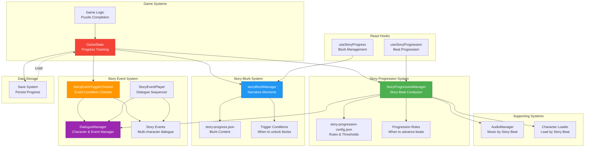

## Story Beat Progression Flow

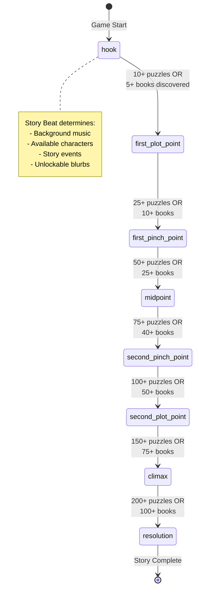

## Complete Story Progression Sequence

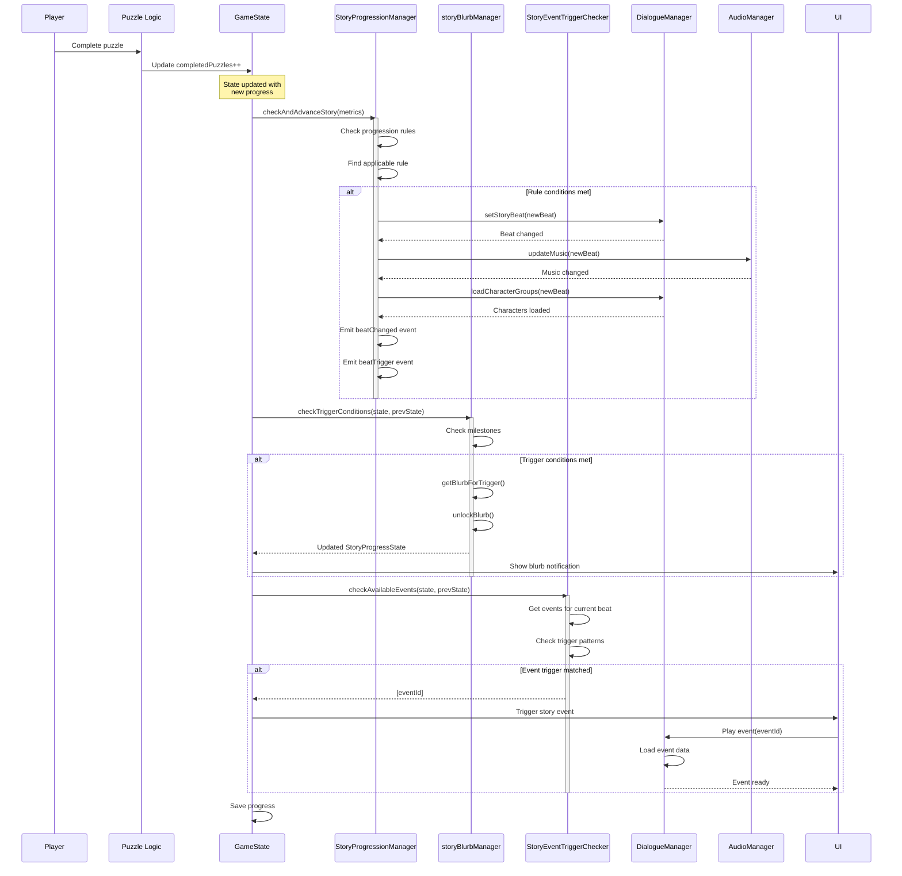

## Story Blurb System Detail

```mermaid
graph TB
    subgraph "Trigger Types"
        GameStart[game_start]
        FirstPuzzle[first_puzzle_complete]
        FirstBook[first_book_complete]
        PuzzleMilestone[puzzles_complete_10/25/50/100]
        BookDisc[books_discovered_5/10/25/50/100]
        BookComp[books_complete_5/10/25]
        KethReveal[kethaneum_genre_revealed]
        KethFirst[kethaneum_first_puzzle]
        KethBook[kethaneum_book_complete]
        BeatTrigger[story_beat_*]
    end

    subgraph "Blurb Data"
        BlurbJSON[story-progress.json]
        BlurbDef[StoryBlurb<br/>id, title, text, trigger, storyBeat]
        TrigConfig[Trigger Config<br/>Milestones, behavior]
    end

    subgraph "State Tracking"
        StoryState[StoryProgressState]
        UnlockedList[unlockedBlurbs: string[]]
        FiredList[firedTriggers: StoryTrigger[]]
        CurrentBeat[currentStoryBeat: StoryBeat]
        CurrentBlurb[currentBlurbId: string]
    end

    subgraph "Manager Logic"
        SBM[storyBlurbManager]
        CheckTrig[checkTriggerConditions]
        GetBlurb[getBlurbForTrigger]
        Unlock[unlockBlurb]
    end

    BlurbJSON --> BlurbDef
    BlurbJSON --> TrigConfig

    BlurbDef --> SBM
    TrigConfig --> SBM

    GameStart --> CheckTrig
    FirstPuzzle --> CheckTrig
    FirstBook --> CheckTrig
    PuzzleMilestone --> CheckTrig
    BookDisc --> CheckTrig
    BookComp --> CheckTrig
    KethReveal --> CheckTrig
    KethFirst --> CheckTrig
    KethBook --> CheckTrig
    BeatTrigger --> CheckTrig

    CheckTrig --> GetBlurb
    GetBlurb --> Unlock

    Unlock --> UnlockedList
    Unlock --> FiredList
    Unlock --> CurrentBlurb

    UnlockedList --> StoryState
    FiredList --> StoryState
    CurrentBeat --> StoryState
    CurrentBlurb --> StoryState

    StoryState -.->|Saved to| SaveSystem[(localStorage)]

    style SBM fill:#2196F3,stroke:#1565C0,color:#fff
    style StoryState fill:#F44336,stroke:#C62828,color:#fff
    style CheckTrig fill:#4CAF50,stroke:#2E7D32,color:#fff
```

## Story Progression Manager Detail

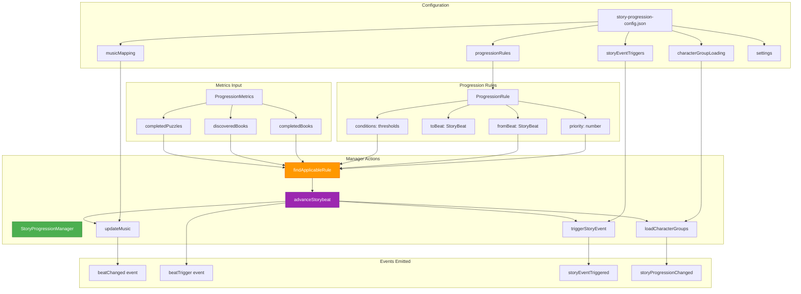

## Story Event System Flow

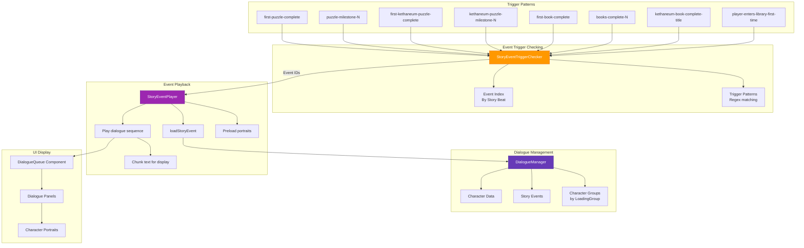

## Character Loading System

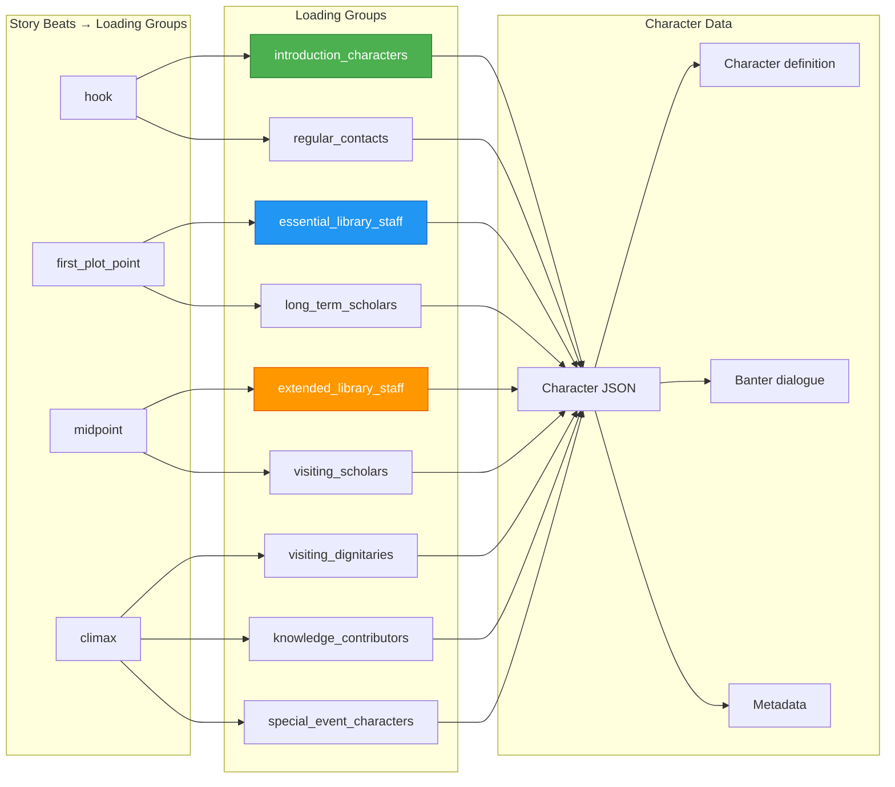

## Data Structures

```mermaid
graph TB
    subgraph "StoryProgressState (Blurbs)"
        SPS[StoryProgressState]
        SPS_Current[currentBlurbId: string]
        SPS_Unlocked[unlockedBlurbs: string[]]
        SPS_Beat[currentStoryBeat: StoryBeat]
        SPS_Updated[lastUpdated: number]
        SPS_Fired[firedTriggers: StoryTrigger[]]
    end

    subgraph "StoryBlurb"
        Blurb[StoryBlurb]
        B_ID[id: string]
        B_Beat[storyBeat: StoryBeat]
        B_Trig[trigger: StoryTrigger]
        B_Title[title: string]
        B_Text[text: string]
        B_Order[order: number]
    end

    subgraph "ProgressionRule"
        Rule[ProgressionRule]
        R_ID[id: string]
        R_From[fromBeat: StoryBeat]
        R_To[toBeat: StoryBeat]
        R_Desc[description: string]
        R_Cond[conditions: thresholds]
        R_Pri[priority: number]
    end

    subgraph "StoryEvent"
        Event[StoryEvent]
        E_Info[storyEvent: metadata]
        E_Dialogue[dialogue: sequence[]]
        E_Chars[characters: refs[]]
        E_Meta[metadata: duration, importance]
    end

    subgraph "StoryEventDialogue"
        Dialogue[StoryEventDialogue]
        D_Seq[sequence: number]
        D_Speaker[speaker: characterId]
        D_Text[text: string]
        D_Emotion[emotion: Emotion[]]
        D_Pause[pauseAfter: boolean]
    end

    SPS --> SPS_Current
    SPS --> SPS_Unlocked
    SPS --> SPS_Beat
    SPS --> SPS_Updated
    SPS --> SPS_Fired

    Blurb --> B_ID
    Blurb --> B_Beat
    Blurb --> B_Trig
    Blurb --> B_Title
    Blurb --> B_Text
    Blurb --> B_Order

    Rule --> R_ID
    Rule --> R_From
    Rule --> R_To
    Rule --> R_Desc
    Rule --> R_Cond
    Rule --> R_Pri

    Event --> E_Info
    Event --> E_Dialogue
    Event --> E_Chars
    Event --> E_Meta

    Dialogue --> D_Seq
    Dialogue --> D_Speaker
    Dialogue --> D_Text
    Dialogue --> D_Emotion
    Dialogue --> D_Pause

    style SPS fill:#F44336,stroke:#C62828,color:#fff
    style Blurb fill:#2196F3,stroke:#1565C0,color:#fff
    style Rule fill:#4CAF50,stroke:#2E7D32,color:#fff
    style Event fill:#9C27B0,stroke:#6A1B9A,color:#fff
```

## Integration with Game Systems

```mermaid
graph TB
    subgraph "Puzzle Completion Flow"
        PuzzComplete[Puzzle Complete]
        UpdateState[Update GameState]
        CheckProg[Check Progression]
        CheckBlurb[Check Blurb Triggers]
        CheckEvent[Check Story Events]
    end

    subgraph "State Updates"
        IncrPuzzles[completedPuzzles++]
        UpdateGenre[completedPuzzlesByGenre]
        UpdateBook[books[title][part] = true]
        CheckBookComp[Check if book complete]
        IncrBooks[completedBooks++]
    end

    subgraph "Story System Responses"
        AdvanceBeat[Advance Story Beat?]
        UnlockBlurb[Unlock Blurb?]
        TriggerEvent[Trigger Event?]
        ChangeMus[Change Music?]
        LoadChars[Load Characters?]
    end

    subgraph "UI Updates"
        ShowBlurb[Show Blurb Notification]
        PlayEvent[Play Story Event]
        UpdateMusic[Fade to New Music]
        SaveProg[Save Progress]
    end

    PuzzComplete --> UpdateState
    UpdateState --> IncrPuzzles
    UpdateState --> UpdateGenre
    UpdateState --> UpdateBook
    UpdateBook --> CheckBookComp
    CheckBookComp -->|Yes| IncrBooks

    IncrPuzzles --> CheckProg
    IncrBooks --> CheckProg

    CheckProg --> AdvanceBeat
    CheckProg --> CheckBlurb
    CheckProg --> CheckEvent

    AdvanceBeat -->|Yes| ChangeMus
    AdvanceBeat -->|Yes| LoadChars

    CheckBlurb --> UnlockBlurb
    CheckEvent --> TriggerEvent

    UnlockBlurb -->|Yes| ShowBlurb
    TriggerEvent -->|Yes| PlayEvent
    ChangeMus -->|Yes| UpdateMusic

    ShowBlurb --> SaveProg
    PlayEvent --> SaveProg
    UpdateMusic --> SaveProg

    style PuzzComplete fill:#4CAF50,stroke:#2E7D32,color:#fff
    style UpdateState fill:#F44336,stroke:#C62828,color:#fff
    style AdvanceBeat fill:#FF9800,stroke:#E65100,color:#fff
    style UnlockBlurb fill:#2196F3,stroke:#1565C0,color:#fff
    style TriggerEvent fill:#9C27B0,stroke:#6A1B9A,color:#fff
```

## File Structure & Configuration

```mermaid
graph TB
    subgraph "Data Files"
        ProgConfig[/data/story-progression-config.json<br/>Story beat rules & transitions]
        BlurbData[/data/story-progress.json<br/>Narrative blurbs & triggers]
        CharFiles[/data/characters/*.json<br/>Character definitions]
        EventFiles[/data/story-events/*.json<br/>Story event dialogues]
    end

    subgraph "Core Managers"
        SPM[lib/story/StoryProgressionManager.ts<br/>Beat progression conductor]
        SBM[lib/story/storyBlurbManager.ts<br/>Blurb system manager]
        DM[lib/dialogue/DialogueManager.ts<br/>Character & event manager]
        SETC[lib/dialogue/StoryEventTriggerChecker.ts<br/>Event trigger checker]
        SEP[lib/dialogue/StoryEventPlayer.ts<br/>Event playback sequencer]
    end

    subgraph "Type Definitions"
        StoryTypes[lib/story/types.ts<br/>Blurb & progression types]
        DialogueTypes[lib/dialogue/types.ts<br/>Character & event types]
    end

    subgraph "React Hooks"
        UseStoryProg[hooks/useStoryProgress.ts<br/>Blurb management hook]
        UseProgHook[hooks/story/useStoryProgression.ts<br/>Beat progression hook]
    end

    subgraph "UI Components"
        Provider[components/StorySystemProvider.tsx<br/>Story system initialization]
        BlurbNotif[components/StoryBlurbNotification.tsx<br/>Blurb display]
        DialogueQ[components/dialogue/DialogueQueue.tsx<br/>Event dialogue display]
    end

    ProgConfig --> SPM
    BlurbData --> SBM
    CharFiles --> DM
    EventFiles --> DM

    SPM --> StoryTypes
    SBM --> StoryTypes
    DM --> DialogueTypes
    SETC --> DialogueTypes
    SEP --> DialogueTypes

    SPM --> UseProgHook
    SBM --> UseStoryProg

    UseProgHook --> Provider
    UseStoryProg --> Provider

    Provider --> BlurbNotif
    Provider --> DialogueQ

    style ProgConfig fill:#fff3e0
    style BlurbData fill:#fff3e0
    style SPM fill:#4CAF50,stroke:#2E7D32,color:#fff
    style SBM fill:#2196F3,stroke:#1565C0,color:#fff
    style DM fill:#9C27B0,stroke:#6A1B9A,color:#fff
```

## Event Trigger Optimization

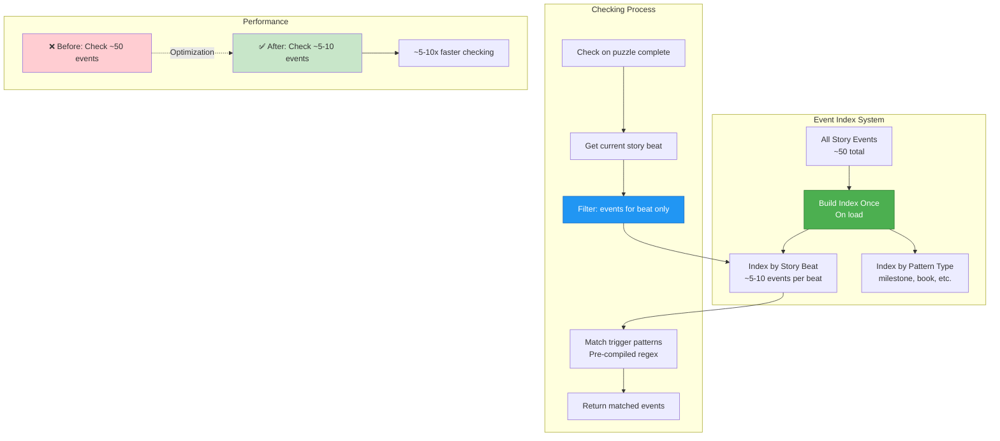

## Trigger Condition Examples

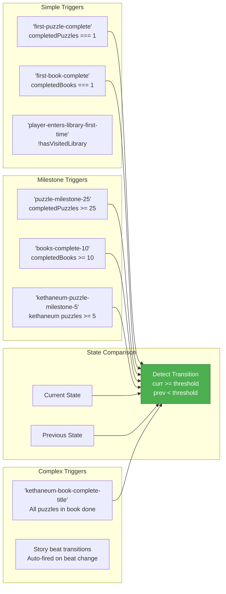

## Story Beat Transitions & Effects

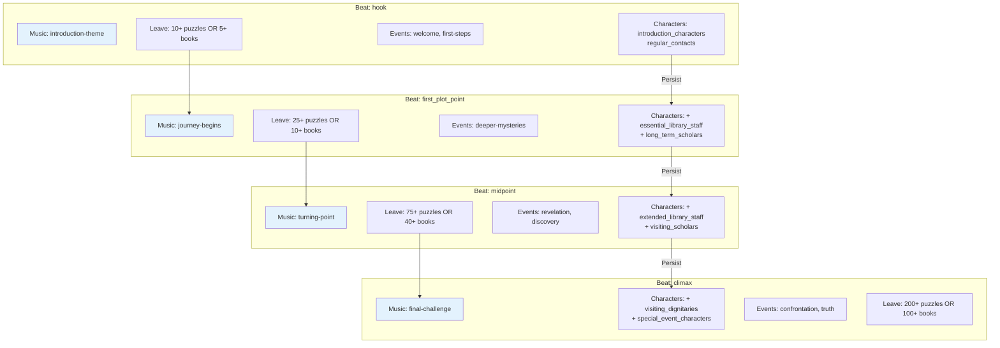

## Persistence & State Management

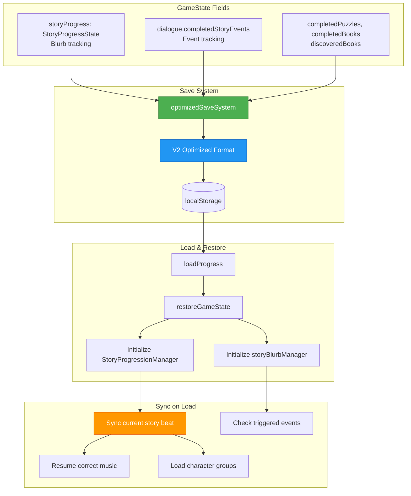

## Key Components Responsibilities

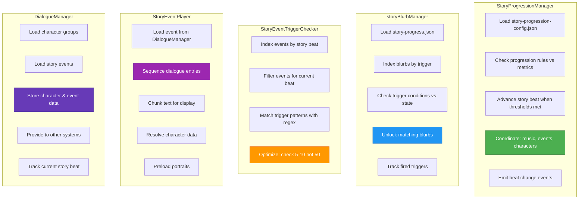

## Testing Considerations

Key areas to test when modifying the story progression system:

1. **Story Beat Progression**
   - Rules trigger at correct thresholds
   - Music changes on beat transition
   - Characters load for correct beats
   - Beat persists across save/load

2. **Story Blurb System**
   - Triggers fire on milestone achievements
   - No duplicate blurbs unlocked
   - Blurbs respect story beat restrictions
   - Fired triggers persist in saves

3. **Story Event System**
   - Events trigger on correct conditions
   - Event index filters correctly
   - Multi-character dialogue sequences work
   - Completed events persist

4. **Integration**
   - Puzzle completion triggers all systems
   - State transitions detected correctly
   - No race conditions on rapid progression
   - Systems don't interfere with each other

5. **Performance**
   - Event checking stays fast (<10ms)
   - Music doesn't restart unnecessarily
   - Characters don't reload on each check
   - Index builds only once

6. **Data Integrity**
   - Config files validate correctly
   - Missing events fail gracefully
   - Character references resolve
   - Story beat order maintained

## Performance Characteristics

- **Story Beat Check**: ~1-5ms (rule evaluation)
- **Blurb Trigger Check**: ~2-10ms (condition matching)
- **Event Trigger Check**: ~1-5ms with indexing (was ~10-50ms)
- **Event Playback**: ~5-20ms per dialogue entry
- **Character Loading**: ~50-200ms per group
- **Music Transition**: ~2000ms fade duration

## Future Considerations

1. **Dynamic Story Branching**: Player choices affect beat progression
2. **Parallel Story Threads**: Multiple storylines tracked simultaneously
3. **Conditional Events**: Events that require multiple conditions
4. **Story Replay**: Rewatch completed events from library
5. **Achievement Tracking**: Story-based achievements and milestones
6. **Analytics**: Track player progression patterns
7. **Localization**: Multi-language story content
8. **Voice Acting**: Audio dialogue for story events
9. **Cutscenes**: Visual accompaniment for major events
10. **Story Editor**: Tools for creating/editing story content
